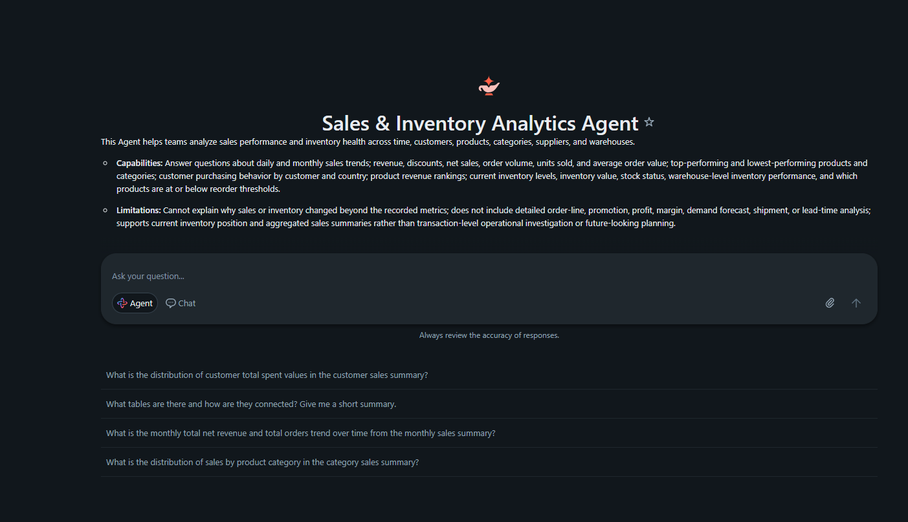
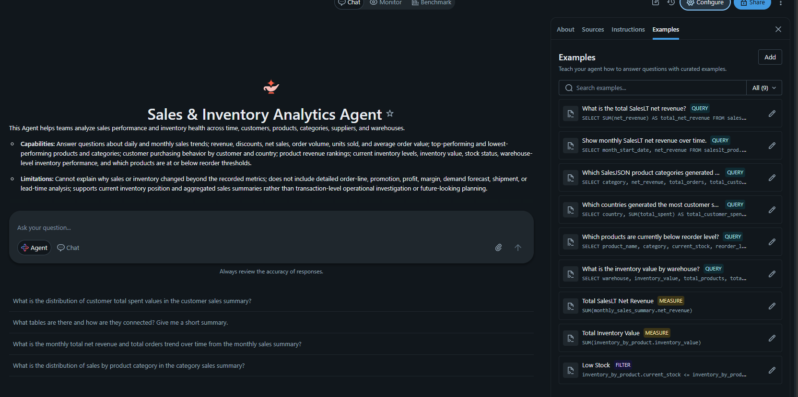
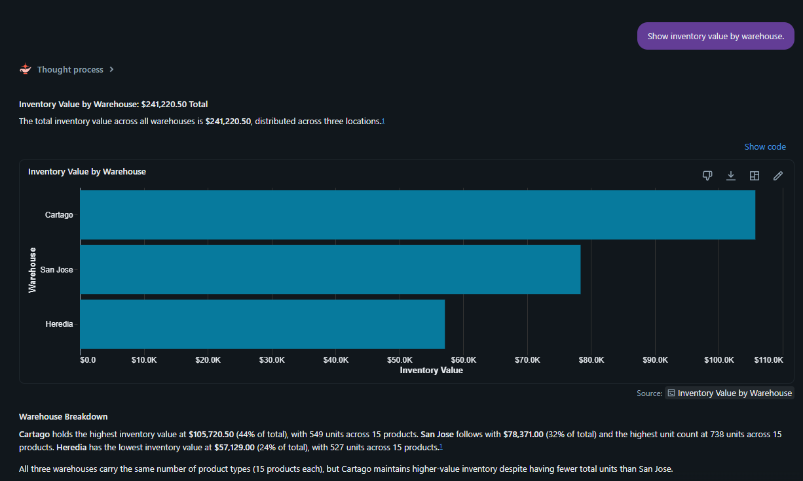

# Azure Databricks Lakehouse Project

[Documentación en español](README_ES.md) | [Professor evaluation guide](README_PROFESSOR_ES.md)

## Overview

This repository implements a governed Azure Databricks lakehouse with separate DEV and PROD resources, Unity Catalog, Microsoft Entra identities, ADLS Gen2 external storage, and a medallion ETL architecture.

The DEV foundation, Unity Catalog grants baseline, ABAC controls, all three ETLs—Sales JSON, Sales CSV, and SalesLT—Bundle automation, and evidence are functionally complete and documented. The PROD foundation, catalogs, grants, manually applied and validated ABAC, GitHub Actions/OIDC deployment, all four Jobs, and Azure Data Factory orchestration are also complete. ADF v2 **adf-centralus-prod** now runs the three operational PROD Jobs in parallel through **pl_databricks_medallion_prod**; the first end-to-end pipeline and all correlated Databricks runs succeeded. Power BI consumption is complete: the published **Sales & Inventory Executive Overview** reads Unity Catalog Gold PROD through the Databricks SQL Warehouse as a Data Analyst. Conversational consumption is also complete: the PROD **Sales & Inventory Analytics Agent** uses the same governed Gold data through the existing SQL Warehouse, and the Data Analyst successfully consumed that agent from the Databricks Genie app in Microsoft Teams. Power BI and Genie now provide complementary dashboard and conversational paths. The bonus **Sales & Inventory Assistant** Databricks App is implemented in source; Databricks deployment, validation, and evidence are still pending.

Validated Sales JSON outcome:

~~~text
15 JSON files / 150 Bronze rows
                 |
                 v
146 valid Silver rows + 4 rejected rows
                 |
                 v
3 external Gold Delta tables
                 |
                 v
Silver revenue 237057.40 = Gold revenue 237057.40 (PASS)
~~~

Validated Sales CSV outcome:

~~~text
15 product rows + 500 inventory transaction rows in Bronze
                              |
                              v
496 valid Silver rows + 4 rejected rows
                              |
                              v
inventory_by_product + inventory_by_warehouse + low_stock_products
                              |
                              v
Unit, inventory value, and low-stock rule validations (PASS)
~~~

Validated SalesLT outcome:

~~~text
Azure SQL SalesLT (public access disabled)
        |
        v
Lakehouse Federation: fc_saleslt_dev
SP authentication + NCC Private Endpoint + Serverless compute
        |
        v
5 source snapshots replicated to external Bronze Delta (all counts PASS)
        |
        v
customers + products + sales_order_lines in Silver
        |
        v
sales_by_product + sales_by_customer + monthly_sales_summary in Gold
        |
        v
Silver 708690.07 = Product Gold 708690.07 = Monthly Gold 708690.07 (PASS)
~~~

## DEV and PROD architecture

| Resource | DEV | PROD |
|---|---|---|
| Databricks workspace | **dbw-centralus-dev01** | **dbw-centralus-prod01** |
| ADLS Gen2 account | **stcentralusjrdev** | **stcentralusjrprod** |
| Databricks Access Connector | **dbac-centralus-dbx-dev** | **dbac-centralus-dbx-prod** |
| Higher-level orchestrator | Not configured | ADF v2 **adf-centralus-prod** |
| Unity Catalog storage credential | **dbac_centralus_dbx_dev** | **dbac_centralus_dbx_prod** |
| External locations | **ext_landing_dev**, **ext_lakehouse_dev**, **ext_streaming_dev** | **ext_landing_prod**, **ext_lakehouse_prod**, **ext_streaming_prod** |
| Catalogs | **saleslt_dev**, **salesjson_dev**, **salescsv_dev** | **saleslt_prod**, **salesjson_prod**, **salescsv_prod** |

The exact PROD storage credential name is **dbac_centralus_dbx_prod**, as configured in **prepenv/00_environment_setup.ipynb**.

The Access Connectors use managed identities to reach ADLS. Unity Catalog storage credentials and external locations provide the governed access boundary; notebooks do not contain storage account keys or SAS tokens.

Each storage account contains:

~~~text
landing/     Incoming JSON and CSV source files
lakehouse/   External Delta tables and catalog managed roots
streaming/   Auto Loader schemas and checkpoints
~~~

Managed catalog roots are isolated under **lakehouse/_managed/<catalog>/**. Explicit external Delta tables use workload paths under **salesjson/** and **salescsv/** for Bronze, Silver, and Gold, so they do not overlap managed roots.

## Unity Catalog model

| Workload | DEV catalog | PROD catalog |
|---|---|---|
| SalesLT | **saleslt_dev** | **saleslt_prod** |
| Sales JSON | **salesjson_dev** | **salesjson_prod** |
| Sales CSV | **salescsv_dev** | **salescsv_prod** |

Every catalog contains:

- **bronze**: raw or minimally processed, source-traceable data.
- **silver**: validated, standardized, deduplicated, and enriched data.
- **gold**: curated business models for Genie, dashboards, Power BI, and applications.

Technical object names and Unity Catalog comments are kept in English for consistent metadata and future Genie usage.

In DEV, Azure SQL SalesLT is exposed through the Lakehouse Federation Foreign Catalog **fc_saleslt_dev**. The connection authenticates with **sp-centraulus-azsql** and reaches an Azure SQL server with public access disabled through a Network Connectivity Configuration (NCC) and Private Endpoint. The PROD foundation, workload catalogs, schemas, and grants are complete, and the corresponding PROD deployment uses **fc_saleslt_prod** and **saleslt_prod**. Replicated and transformed Delta data stays in **saleslt_<environment>**.

## Identities and permissions

| Principal | Responsibility |
|---|---|
| **admins** | Environment bootstrap, ownership, and administration. |
| **grp-dbx-developers** | Microsoft Entra account group for engineering in DEV; it has no direct access to PROD. |
| **grp-dbx-analysts** | Microsoft Entra account group with Gold-only consumption. |
| **sp-centraulus-dbx-main** | Common Job `run_as` identity in DEV and PROD and, for this academic project, the GitHub OIDC deployment identity for PROD. Application ID: **acc15410-5c5f-473e-bc6f-61b7946176a2**. GitHub uses federated OIDC authentication with no stored client secret. The DEV bundle was deployed interactively by **josrami**. |
| **sp-centraulus-azsql** | Connection identity used by the DEV SalesLT Azure SQL federated connection. |
| **adf-centralus-prod** system-assigned managed identity | Control-plane orchestration only. It has `CAN MANAGE RUN` on the three PROD ETL Jobs and no Unity Catalog or ADLS data-plane grants. |

Main Unity Catalog grants:

| Principal | Catalogs and schemas | landing | lakehouse | streaming |
|---|---|---|---|---|
| Admin | Ownership and administration | Owner | Owner | Owner |
| Developers in DEV | USE CATALOG; USE SCHEMA, CREATE TABLE, SELECT, MODIFY on Bronze, Silver, and Gold | READ FILES | CREATE EXTERNAL TABLE | READ FILES, WRITE FILES |
| Developers in PROD | No direct grant | No direct grant | No direct grant | No direct grant |
| Analysts | USE CATALOG; USE SCHEMA and SELECT on Gold only | None | None | None |
| ETL service principal | USE CATALOG; USE SCHEMA, CREATE TABLE, SELECT, MODIFY on all medallion schemas | READ FILES | CREATE EXTERNAL TABLE | READ FILES, WRITE FILES |

The ETL service principal does not receive CREATE CATALOG, CREATE SCHEMA, MANAGE, OWNERSHIP, or direct access to the storage credential. Once an external Delta table is registered, data changes are governed through MODIFY; arbitrary writes to the lakehouse container are not granted.

In PROD, developers have no direct access. Analysts consume Gold only, while the ETL service principal executes the workloads across Bronze, Silver, and Gold and uses the required external locations.

### DEV security baseline and ABAC

The existing Unity Catalog grants baseline is implemented by **security/00_unity_catalog_grants.ipynb** and provides the catalog, schema, table, and external-location permissions summarized above. ABAC adds data-level controls without replacing those baseline grants.

The account-level governed tag **data_classification** drives both completed ABAC policies:

| Control | Protected column | Governed-tag value | Behavior for **grp-dbx-analysts** | Admin/developer behavior |
|---|---|---|---|---|
| Column mask (**mask_pii_email_for_analysts**) | **saleslt_dev.gold.sales_by_customer.customer_email** | **pii_email** | Email is masked, preserving only the first character and domain, for example `j***@example.com`. | Original email is visible. |
| Row filter (**filter_country_for_analysts**) | **salesjson_dev.gold.customer_sales_summary.country** | **geo_country** | Only rows where country is **Costa Rica** are visible. | All country rows are visible. |

Observed DEV row-filter validation:

| Identity | Costa Rica | United States | Mexico | Colombia | Total |
|---|---:|---:|---:|---:|---:|
| Admin/developer | **34** | **24** | **19** | **15** | **92** |
| **grp-dbx-analysts** | **34** | **0** | **0** | **0** | **34** |

The Databricks notebook task **security/01_abac_policies.py** defines the tag-based column mask and row filter; this repository versions its exported notebook as **security/01_abac_policies.ipynb**. Grants evidence is stored under **evidence/Security/UC_GRANTS/**, while policy configuration and identity-specific query results are stored under **evidence/Security/ABAC/**. With the baseline grants and ABAC validations complete, Security DEV is complete.

## Sales JSON ETL

### Reproducible dataset

**datasets/salesjson/generate_sales_orders.py** creates 15 newline-delimited JSON files with 10 orders each:

- **orders_001.json** through **orders_005.json**: base schema.
- **orders_006.json** through **orders_010.json**: base schema plus four deliberate business-quality errors.
- **orders_011.json** through **orders_015.json**: add **shipping_priority** to test schema evolution.

The invalid records exercise quantity = 0, unit_price = -25.00, discount = 1.25, and customer_id = null.

The complete 15-file sequence and the observed schema-evolution evidence below apply to DEV. The current PROD dataset contains only the five base-schema files (001-005), so **shipping_priority** may be absent there without indicating a failure.

### Bronze: incremental ingestion

Notebook: **process/salesjson/01_bronze_ingestion.ipynb**

Target: **salesjson_<environment>.bronze.orders_raw**

Bronze:

- reads **landing/salesjson/incoming/** with Auto Loader and cloudFiles.format = json;
- runs on Databricks Serverless compute with the configured NCC network path;
- uses Unity Catalog Managed File Events;
- persists inferred schema under **streaming/salesjson/schemas/orders/**;
- enables cloudFiles.schemaEvolutionMode = addNewColumns;
- preserves incompatible fields in **_rescued_data**;
- adds source filename, path, file modification time, and ingestion timestamp;
- writes append-only data to an external Delta table with mergeSchema;
- stores state under **streaming/salesjson/checkpoints/bronze_orders/**; and
- runs with availableNow=True to process available files and stop.

DEV validation demonstrated initial and incremental discovery, checkpoint persistence, Managed File Events, and the expected restart/retry behavior when **shipping_priority** was discovered.

### Silver: standardization and data quality

Notebook: **process/salesjson/02_silver_transformation.ipynb**

Targets:

- **salesjson_<environment>.silver.orders**
- **salesjson_<environment>.silver.rejected_orders**

Silver normalizes identifiers and text; casts quantities, monetary values, discounts, and timestamps; calculates **gross_amount**, **discount_amount**, and **net_amount**; applies ordered quality rules; quarantines invalid rows with **rejection_reason**; and deduplicates by **order_id**, keeping the latest ingestion.

The initial execution creates external Delta tables. Later executions use Delta MERGE with schema evolution. Existing keys are updated only when the source **ingestion_timestamp** is newer; new keys are inserted.

### Gold: analytical summaries

Notebook: **process/salesjson/03_gold_analytics.ipynb**

| Table | Grain and purpose |
|---|---|
| **daily_sales_summary** | One row per date with order/customer counts, units, gross revenue, discounts, net revenue, and order-value statistics. |
| **category_sales_summary** | One row per category with the same measures and a total_orders >= 2 filter. |
| **customer_sales_summary** | One row per customer and country with activity, units, totals, averages, and first/last order timestamps. |

Gold reads only from Silver. The three external Delta tables use snapshot-style MERGE: update matches, insert new aggregates, and delete target rows absent from the current source snapshot.

## DEV validation and evidence

Notebook: **process/salesjson/99_phase_validation.ipynb**

| Check | Observed result |
|---|---:|
| Bronze rows | **150** |
| Valid Silver rows | **146** |
| Rejected Silver rows | **4** |
| Gold daily rows | **20** |
| Gold category rows | **3** |
| Gold customer rows | **92** |
| Schema evolution | **shipping_priority present in DEV** |
| Silver net revenue | **237057.40** |
| Gold net revenue | **237057.40** |
| Reconciliation | **PASS** |

DEV screenshots under **evidence/Medallion/salesjson/** cover layer counts, every Bronze source file, Auto Loader checkpoint state, schema evolution, rejected records, Gold output, and Silver-to-Gold revenue reconciliation.

## Sales CSV ETL

### Source and reproducible dataset

**datasets/salescsv/generate_inventory_data.py** generates two CSV datasets delivered through ADLS Gen2 and accessed by the Databricks Access Connector Managed Identity:

- **product_catalog.csv**: 15 product records used as reference data.
- **inventory_transactions.csv**: 500 inventory movement records, including four deliberately invalid records for data-quality validation.

### Bronze: PySpark batch ingestion

Notebook: **process/salescsv/01_bronze_ingestion.ipynb**

Targets:

- **salescsv_<environment>.bronze.product_catalog_raw**
- **salescsv_<environment>.bronze.inventory_transactions_raw**

Bronze uses PySpark batch reads with **header=true** and **inferSchema=true**, adds source and ingestion metadata, and writes governed external Delta tables. The initial load creates each table at its explicit ADLS path; later executions use an idempotent Delta MERGE so the same source data can be processed safely without duplicate business keys.

### Silver: casting, enrichment, and data quality

Notebook: **process/salescsv/02_silver_transformation.ipynb**

Targets:

- **salescsv_<environment>.silver.inventory_movements**
- **salescsv_<environment>.silver.rejected_transactions**

Silver applies explicit casting and **try_cast** for malformed values, then performs a **LEFT JOIN** from inventory transactions to the product catalog. Ordered data-quality rules separate 496 valid records from 4 rejected records and preserve the rejection reason in **rejected_transactions**. The valid model derives signed **inventory_change** and **inventory_value_change** measures. Both valid and rejected external Delta tables are maintained with idempotent Delta MERGE logic.

### Gold: inventory analytics

Notebook: **process/salescsv/03_gold_analytics.ipynb**

| Table | Grain and purpose |
|---|---|
| **inventory_by_product** | One row per product with inventory activity, units, value, and warehouse coverage. |
| **inventory_by_warehouse** | One row per warehouse with product and transaction coverage plus inventory movement statistics. |
| **low_stock_products** | Business-filtered product snapshot for items at or below their reorder level. |

Gold reads only from valid Silver data. The models use **GROUP BY**, **COUNT DISTINCT**, **SUM**, **AVG**, **MIN**, and **MAX** aggregations plus the low-stock business filter. All three external Delta tables use snapshot MERGE semantics: update matches, insert new aggregates, and delete target rows absent from the current source snapshot.

### Metadata, validation, and evidence

- **process/salescsv/98_metadata_documentation.ipynb** applies English table and column comments across all Sales CSV Bronze, Silver, and Gold tables, including Genie-friendly business descriptions.
- **process/salescsv/99_phase_validation.ipynb** validates medallion counts, rejected records, join enrichment, external Delta registration, and cross-layer reconciliation.
- **evidence/Medallion/salescsv/** contains the execution screenshots for counts, rejected records, the Silver-to-Gold reconciliation, Gold outputs, external tables, join behavior, and the low-stock rule.

| Check | Observed result |
|---|---:|
| Product Bronze rows | **15** |
| Inventory Bronze rows | **500** |
| Valid Silver rows | **496** |
| Rejected Silver rows | **4** |
| Gold product rows | **15** |
| Gold warehouse rows | **3** |
| Unit reconciliation | **PASS** |
| Inventory value reconciliation | **PASS** |
| Low-stock business rule | **PASS** |

## SalesLT ETL

### Federated Azure SQL source and private connectivity

The DEV source is Azure SQL SalesLT with public network access disabled. Databricks Lakehouse Federation exposes it as the Foreign Catalog **fc_saleslt_dev**. The connection authenticates with the service principal **sp-centraulus-azsql**, and Databricks Serverless compute reaches the database through the workspace NCC and its approved Private Endpoint.

### Bronze: federated snapshot replication

Notebook: **process/saleslt/01_bronze_ingestion.ipynb**

Bronze reads five source tables through Lakehouse Federation and materializes current snapshots as governed external Delta tables in **saleslt_<environment>.bronze**:

| Azure SQL source | External Bronze target | DEV validation |
|---|---|---:|
| **Customer** | **customer_raw** | **847 = 847 (PASS)** |
| **Product** | **product_raw** | **295 = 295 (PASS)** |
| **ProductCategory** | **product_category_raw** | **41 = 41 (PASS)** |
| **SalesOrderHeader** | **sales_order_header_raw** | **32 = 32 (PASS)** |
| **SalesOrderDetail** | **sales_order_detail_raw** | **542 = 542 (PASS)** |

The initial load creates the external Delta tables at explicit ADLS paths. Later runs synchronize each snapshot with Delta MERGE, including updates, inserts, and deletion of target rows no longer present in the federated source.

### Silver: joined business models

Notebook: **process/saleslt/02_silver_transformation.ipynb**

| Table | DEV rows | Purpose |
|---|---:|---|
| **customers** | **847** | Clean customer dimension with normalized names, contact fields, and timestamps. |
| **products** | **295** | Product dimension enriched with product category and active-status metadata. |
| **sales_order_lines** | **542** | Order-detail fact joined to headers, customers, products, and categories. |

Silver applies joins, trimming and normalization, explicit typing, business-validity filters, and snapshot MERGE. Monetary values are normalized to two-decimal precision for consistent analytics; **unit_price_discount** retains four decimal places.

### Gold: sales analytics

Notebook: **process/saleslt/03_gold_analytics.ipynb**

| Table | Grain and purpose |
|---|---|
| **sales_by_product** | Product performance with orders, customers, units, revenue statistics, and dense revenue ranking. |
| **sales_by_customer** | Customer purchasing activity, distinct products, spend, and first/last order dates. |
| **monthly_sales_summary** | Monthly order, customer, product, unit, and revenue measures. |

Gold reads only from **silver.sales_order_lines**, uses aggregations and ranking, and persists all three models as external Delta tables with snapshot MERGE semantics.

### Metadata, validation, and evidence

- **process/saleslt/98_metadata_documentation.ipynb** applies English table and column comments across SalesLT Bronze, Silver, and Gold.
- **process/saleslt/99_phase_validation.ipynb** checks federation-to-Bronze counts, Silver models, joined data, Gold outputs, and revenue reconciliation.
- **evidence/Medallion/saleslt/** contains screenshots for SQL-source-to-Bronze reconciliation, Silver counts and joins, all three Gold outputs, and Gold revenue reconciliation.

| Check | Observed result |
|---|---:|
| Federation-to-Bronze snapshot counts | **PASS for all 5 tables** |
| Silver customers | **847** |
| Silver products | **295** |
| Silver sales order lines | **542** |
| Silver revenue | **708690.07** |
| Product Gold revenue | **708690.07** |
| Monthly Gold revenue | **708690.07** |
| Gold reconciliation | **PASS** |

## Common ETL notebook pattern

Each of the three workloads follows the same ordered notebook contract:

~~~text
01_bronze_ingestion.py
02_silver_transformation.py
03_gold_analytics.py
98_metadata_documentation.py
99_phase_validation.py
~~~

The repository stores these notebooks as **.ipynb** exports under **process/<workload>/**. The **.py** names above describe the shared Databricks notebook pattern implemented by the Bundle Job resources.

## Repository layout

~~~text
repo_dbx_jr/
├── .github/workflows/deploy-prod.yml
├── datasets/salescsv/
├── datasets/salesjson/
├── evidence/README.md
├── evidence/Automation/
│   ├── ADF/
│   │   └── README.md
│   ├── Bundles/
│   ├── GitHubActions/
│   │   └── README.md
│   └── Metadata/
│       └── README.md
├── evidence/Consumption/
│   ├── Genie/
│   │   └── README.md
│   └── PowerBI/
│       └── README.md
├── evidence/Medallion/
│   ├── salescsv/
│   ├── salesjson/
│   └── saleslt/
├── evidence/Security/
│   ├── UC_GRANTS/
│   └── ABAC/
├── prepenv/00_environment_setup.ipynb
├── process/salescsv/
│   ├── 01_bronze_ingestion.ipynb
│   ├── 02_silver_transformation.ipynb
│   ├── 03_gold_analytics.ipynb
│   ├── 98_metadata_documentation.ipynb
│   └── 99_phase_validation.ipynb
├── process/salesjson/
│   ├── 01_bronze_ingestion.ipynb
│   ├── 02_silver_transformation.ipynb
│   ├── 03_gold_analytics.ipynb
│   ├── 98_metadata_documentation.ipynb
│   └── 99_phase_validation.ipynb
├── process/saleslt/
│   ├── 01_bronze_ingestion.ipynb
│   ├── 02_silver_transformation.ipynb
│   ├── 03_gold_analytics.ipynb
│   ├── 98_metadata_documentation.ipynb
│   └── 99_phase_validation.ipynb
├── resources/
│   ├── metadata.job.yml
│   ├── salescsv.job.yml
│   ├── salesjson.job.yml
│   └── saleslt.job.yml
├── security/
│   ├── 00_unity_catalog_grants.ipynb
│   └── 01_abac_policies.ipynb
├── README.md
├── README_ES.md
└── README_PROFESSOR_ES.md
~~~

The environment, security, and ETL notebooks accept **environment=dev|prod**; the same code selects the corresponding storage account and catalog. Their source widgets now default to an empty value, so an interactive run fails safely unless the operator explicitly enters exactly `dev` or `prod`. Bundle Jobs remain automated because every task passes the environment from the selected Bundle target. All three ETLs were validated functionally in DEV and their operational Bronze-to-Gold Jobs ran successfully in PROD. The SalesLT connection, private network path, and processing were validated on Databricks Serverless compute; Sales JSON was also validated with its Serverless/NCC path.

## DEV and PROD automation with Databricks Bundles

[Databricks Declarative Automation Bundles](https://docs.databricks.com/aws/en/dev-tools/bundles/jobs-tutorial), formerly Databricks Asset Bundles, version the same three operational ETL Jobs plus one manual metadata Job for DEV and PROD. The bundle-level `run_as` is **sp-centraulus-dbx-main** (application ID **acc15410-5c5f-473e-bc6f-61b7946176a2**) for all workloads in both targets. DEV was deployed interactively by **josrami**. For the academic PROD implementation, **sp-centraulus-dbx-main** is also the deployment identity trusted by GitHub OIDC; no client secret is stored in GitHub.

Implemented automation and evidence structure:

~~~text
.github/workflows/deploy-prod.yml
databricks.yml
resources/
├── metadata.job.yml
├── salesjson.job.yml
├── salescsv.job.yml
└── saleslt.job.yml
evidence/Automation/
├── ADF/
│   └── README.md
├── Bundles/
├── GitHubActions/
│   └── README.md
└── Metadata/
    └── README.md
~~~

Each operational Job uses **Bronze -> Silver -> Gold**, passes the target-specific `environment=dev|prod`, and shares the `{{job.start_time.iso_datetime}}` ingestion timestamp.

| Resource key | Compute in DEV and PROD | Explicit retry policy | Trigger behavior |
|---|---|---|---|
| **salesjson_medallion** | Serverless Jobs | Bronze: 2 retries / 30 s; Silver and Gold: 1 retry / 30 s | DEV File Arrival is `PAUSED`; PROD has no trigger |
| **salescsv_medallion** | Classic single-node Job Compute: DBR 17.3 LTS, `Standard_D4ds_v4`, Photon, Standard access mode, `num_workers: 0`, no autoscaling | All tasks: 1 retry / 30 s | DEV schedule is `PAUSED`; PROD has no trigger |
| **saleslt_medallion** | Serverless Jobs; federation uses **sp-centraulus-azsql** | Bronze: 3 retries / 60 s; Silver and Gold: 1 retry / 30 s | DEV schedule is `PAUSED`; PROD has no trigger |
| **metadata_documentation** | Three parallel Serverless notebook tasks | No explicit retries | Manual only in both targets; no schedule or trigger |

Every explicit policy sets `retry_on_timeout: true`. The retries are safe because the workloads use checkpoints or idempotent Delta MERGE patterns rather than blind duplicate inserts. DEV triggers were briefly validated and then left `PAUSED`; the PROD target intentionally defines no Databricks triggers because ADF is the active higher-level orchestrator.

The three `98_metadata_documentation.ipynb` notebooks are intentionally excluded from the operational ETL Jobs and grouped in the separate manual **Metadata Documentation** Job. It has no schedule or trigger, inherits bundle-level `run_as` **sp-centraulus-dbx-main**, and passes the target-specific environment explicitly. The Job ran successfully in PROD with `environment=prod`, so the comments were applied by the controlled runtime identity without granting Jose or other developers interactive PROD data permissions. The `99_phase_validation.ipynb` notebooks remain available for separate audit or troubleshooting runs and are not part of the metadata Job.

Validated DEV workflow:

~~~text
databricks bundle validate -t dev
databricks bundle deploy -t dev
databricks bundle run -t dev salesjson_medallion
databricks bundle run -t dev salescsv_medallion
databricks bundle run -t dev saleslt_medallion
databricks bundle summary -t dev
~~~

### Successful PROD CI/CD and metadata closure

The **.github/workflows/deploy-prod.yml** workflow runs on a push to **main** or by manual dispatch. It requests `id-token: write`, authenticates to Databricks with GitHub OIDC, and uses the GitHub Environment **prod** with a Required Reviewer. After approval, the workflow completed all of the following successfully:

~~~text
databricks bundle validate -t prod
databricks bundle deploy -t prod
databricks bundle summary -t prod
databricks bundle run -t prod salescsv_medallion
databricks bundle run -t prod salesjson_medallion
databricks bundle run -t prod saleslt_medallion
~~~

The bundle was deployed under **/Workspace/prod/ETLs**. The original PROD rollout created and successfully executed the three operational Jobs: **SalesJSON Medallion** on Serverless, **SalesCSV Medallion** on classic single-node Job Compute, and **SalesLT Medallion** on Serverless.

PR #3 promoted the empty default for notebook `environment` widgets together with `resources/metadata.job.yml` to `main`. The resulting push reran the PROD GitHub Actions flow: Bundle validation and deployment succeeded, and the deployment reconciled the existing resources rather than creating duplicate ETL Jobs. PROD now contains four Jobs. **Metadata Documentation** is the fourth resource, is manual with no trigger or schedule, has three parallel Serverless tasks, and runs as **sp-centraulus-dbx-main**. Its successful PROD run received `environment=prod` explicitly from the Bundle target. The three operational ETL Jobs also remain successful, and no interactive PROD data permissions were required for Jose or the developers group. The `99_phase_validation` notebooks remain outside this operational flow.

DEV Bundle evidence is stored in **evidence/Automation/Bundles/**. PROD CI/CD, OIDC, GitHub Environment, workspace, and Job evidence is organized under **evidence/Automation/GitHubActions/**. The normalized `09_prod_jobs_overview.png` shows all four Jobs and their recent success indicators. **evidence/Automation/Metadata/README.md** distinguishes this completed deployment/run from the remaining detailed screenshots to capture; no missing screenshot is presented as completed evidence.

### Azure Data Factory PROD orchestration

ADF v2 **adf-centralus-prod** is the higher-level PROD orchestrator. Pipeline **pl_databricks_medallion_prod** uses linked service **ls_databricks_prod**, created from the Databricks Job activity with the factory's system-assigned managed identity and Serverless for the control connection.

That managed identity has `CAN MANAGE RUN` on the three Bundle-managed PROD Jobs and has no Unity Catalog or ADLS data-plane permissions. Job definitions, compute, retry policies, parameters, and deployments remain owned by the Databricks Bundle; every workload continues to run as **sp-centraulus-dbx-main**.

The pipeline launches **SalesJSON Medallion**, **SalesCSV Medallion**, and **SalesLT Medallion** in parallel. ADF retry is **0** because workload retries remain inside the Databricks Jobs. **Metadata Documentation** is manual and intentionally excluded from ADF. The first end-to-end ADF run completed with all three activities and the overall pipeline in `Succeeded`, and the matching runs were verified in Databricks. **ADF orchestration status: COMPLETE.** The evidence checklist is under **evidence/Automation/ADF/**.

## Power BI consumption

**Power BI consumption status: COMPLETE.** Power BI Desktop and Power BI Service connect through the Azure Databricks SQL Warehouse to Unity Catalog Gold tables in PROD:

~~~text
Power BI Desktop / Power BI Service
                |
                v
Azure Databricks SQL Warehouse (PROD)
                |
                v
Unity Catalog Gold PROD
~~~

The connection uses the **Data Analyst** identity and consumer-style Gold access rather than developer access to PROD. Databricks Query History confirms requests with `Source=PowerBI`, the PROD SQL Warehouse compute, and `User=Data Analyst`.

The report consumes these Gold tables:

- `saleslt_prod.gold.monthly_sales_summary`
- `saleslt_prod.gold.sales_by_product`
- `saleslt_prod.gold.sales_by_customer`
- `salescsv_prod.gold.inventory_by_product`
- `salescsv_prod.gold.inventory_by_warehouse`
- `salescsv_prod.gold.low_stock_products`

No artificial relationships were created between aggregated Gold tables. Each visual reads the table whose grain matches the metric. The **Sales & Inventory Executive Overview** contains **Total Revenue**, **Total Orders**, **Total Customers**, **Low Stock Products**, **Monthly Net Revenue**, **Net Revenue by Product Category**, **Inventory Value by Warehouse**, and **Products Requiring Replenishment**. The completed report was published successfully to the Power BI Service workspace **DBXJR**. Copilot was not required for this implementation.

The concise screenshot checklist and the rest of the Power BI evidence are in **evidence/Consumption/PowerBI/**.

## Databricks Genie and Microsoft Teams consumption

**Genie Agent status: COMPLETE. Microsoft Teams integration status: COMPLETE.** The PROD **Sales & Inventory Analytics Agent** uses the existing Databricks SQL Warehouse and Unity Catalog Gold PROD tables for governed sales and inventory analytics.

Its General Instructions select the correct Gold table for each workload, use `net_revenue` as the default revenue metric, forbid inferred joins between SalesJSON, SalesCSV, and SalesLT, and prevent treating similarly named IDs from different workloads as equivalent. The agent also follows Unity Catalog permissions and governed policies.

The semantic tuning contains **6 example queries**, **2 measures**, and **1 filter**. The example queries cover total and monthly SalesLT net revenue, SalesJSON category revenue, customer spending by country, products below reorder level, and inventory value by warehouse. The measures are **Total SalesLT Net Revenue** and **Total Inventory Value**; the reusable filter is **Low Stock**.

Validated Genie results include:

- total SalesLT net revenue of **708,690.07**;
- inventory value broken down by warehouse with a generated chart;
- **3** products below reorder level: **Gaming Laptop**, **Conference Speaker**, and **Mini PC**;
- **Costa Rica** as the highest-spending country in the current SalesJSON customer summary, with **29,956.50** across **18 customers**.

The Databricks Genie app in Microsoft Teams was connected to the same **Sales & Inventory Analytics Agent**. The **Data Analyst** successfully asked `Which products are currently below reorder level?` and received the same three governed results with sources. Teams is an external consumer surface; query execution, data access, and governance remain in Databricks and Unity Catalog. Power BI and Genie therefore represent two complementary consumption paths: a curated BI dashboard and conversational analytics.

The complete, normalized Genie and Teams screenshot set is documented under **evidence/Consumption/Genie/**.

## Bonus Databricks App

**Status: IMPLEMENTED IN SOURCE / PENDING DATABRICKS DEPLOYMENT AND EVIDENCE.** The lightweight Streamlit **Sales & Inventory Assistant** in **apps/sales_inventory_assistant/** provides a custom UI over the same existing Genie Agent. It preserves the Genie conversation in the user session, supports four quick prompts and free-form questions, and displays final response text plus generated SQL when safely available. It uses `WorkspaceClient()` with the `genie-space` App Resource and contains no hardcoded tokens or Databricks resource IDs. The intended path is **Databricks App -> Genie Agent -> SQL Warehouse -> Unity Catalog Gold**. Manual deployment instructions are in the app README, and the future screenshot checklist is under **evidence/Consumption/DatabricksApp/**.

## Representative evidence

Only representative screenshots are shown here; the complete, normalized evidence set is organized under **evidence/Medallion/**, **evidence/Security/**, **evidence/Automation/**, and **evidence/Consumption/**. See **evidence/README.md** for the short index.

Databricks Query History confirms Power BI requests through the PROD SQL Warehouse as Data Analyst:

The completed report in Power BI Desktop:

The published report in the Power BI Service workspace DBXJR:

The PROD Genie Agent overview defines its sales and inventory scope:

The curated Genie examples show the six queries, two measures, and Low Stock filter:

Genie returns the warehouse inventory breakdown and chart from Gold PROD:

The Data Analyst receives the governed low-stock result through Microsoft Teams:

GitHub Actions PROD deployment completed successfully:

ADF launched all three PROD Jobs in parallel and the pipeline succeeded:

The four Bundle-managed PROD Jobs are deployed under the controlled runtime identity:

ABAC masks customer email for the analyst identity:

ABAC restricts the analyst view to the permitted country:

Auto Loader schema evolution added and validated `shipping_priority`:

SalesLT federation and Bronze row counts reconcile across all five source tables:

## Project status

- DEV foundation, Unity Catalog grants, ABAC, ETLs, validation, evidence, Bundle deployment, and Phase 5.3 operational hardening: complete.
- PROD foundation, catalogs, schemas, Unity Catalog grants, manually applied and validated ABAC, GitHub OIDC CI/CD, three successful Bronze-to-Gold ETL Job runs, explicit-environment cleanup, successful deployment/run of **Metadata Documentation**, and ADF orchestration: complete.
- ADF v2 **adf-centralus-prod** runs the three PROD ETL Jobs in parallel through **pl_databricks_medallion_prod**; the first end-to-end pipeline and correlated Databricks runs succeeded.
- Power BI consumption: complete. **Sales & Inventory Executive Overview** is published in Power BI Service and consumes PROD Gold through the Databricks SQL Warehouse as Data Analyst.
- Databricks Genie consumption: complete. **Sales & Inventory Analytics Agent** uses the existing PROD SQL Warehouse, governed Gold tables, workload-safe instructions, and the curated set of 6 example queries, 2 measures, and 1 filter.
- Microsoft Teams integration: complete. The Data Analyst connected the Databricks Genie app to the same agent and validated the three-product low-stock response with sources.
- Bonus Databricks App: **implemented in source / pending Databricks deployment and evidence**. The Streamlit UI reuses the existing Genie Agent through the managed `genie-space` App Resource.
- This documentation closure is prepared on **dev_qa** without an automatic merge to `main`.
- Detailed metadata screenshots remain to be captured as evidence, but the PROD deployment and execution are not pending. Run `99_phase_validation` separately only when audit or troubleshooting evidence is needed.
- Remaining work: deploy and validate the Databricks App, capture its four evidence screenshots, then finish evidence cleanup and presentation preparation.
