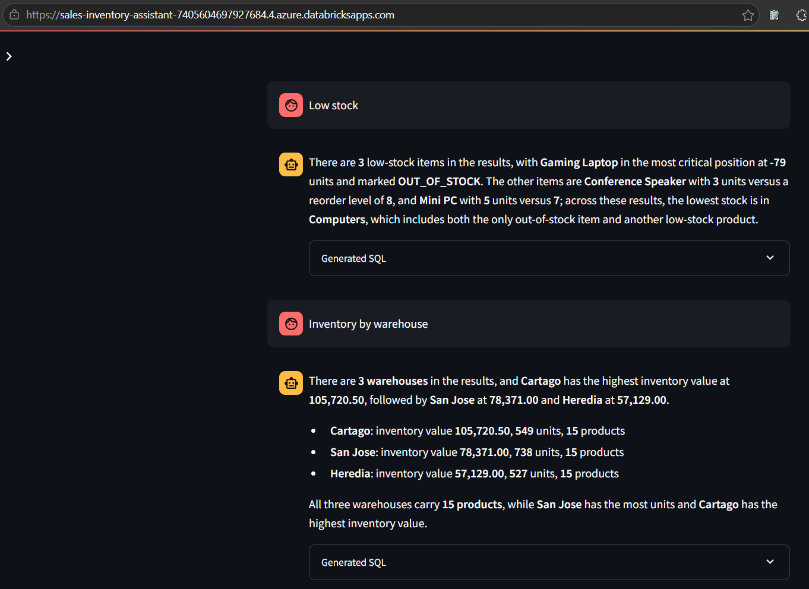
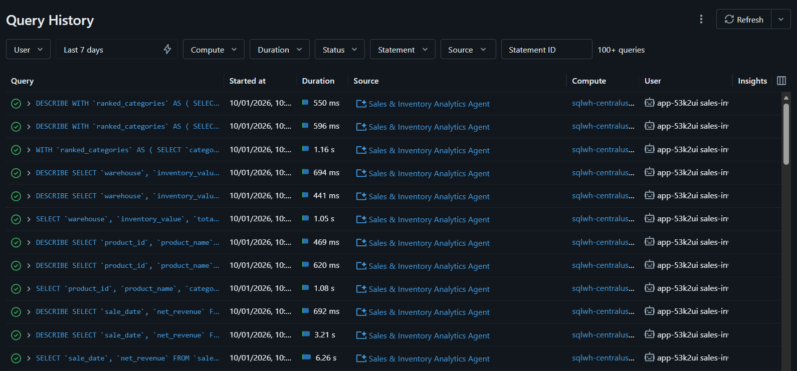

# Lakehouse de Azure Databricks con nivel de producción

[English version](README.md) · [Guía de evaluación](README_PROFESSOR_ES.md) · [Índice de evidencias](evidence/README.md)

**Estado final: COMPLETO.** Este proyecto entrega un lakehouse gobernado, automatizado y validado en producción sobre Azure Databricks, con ambientes DEV y PROD aislados. Incluye ingesta, transformaciones Medallion, gobierno con Unity Catalog, conectividad privada, CI/CD, orquestación superior, BI, analítica conversacional y una Databricks App personalizada.

La implementación cuenta una sola historia de extremo a extremo:

~~~text
Fuentes -> Bronze -> Silver -> Gold -> SQL Warehouse -> Power BI / Genie / Teams / Databricks App
               |         |        |
               +---------+--------+-> Unity Catalog, ABAC, linaje, metadata y validación

GitHub + OIDC -> validar/desplegar Bundle -> Jobs PROD
Managed Identity de ADF -----------------> ejecución paralela de Jobs PROD
~~~

## Resumen ejecutivo

Tres patrones de ingesta diferentes demuestran que la arquitectura no depende de una sola fuente ni de un único modelo de cómputo:

| Workload | Fuente e ingesta | Cómputo | Resultado validado |
|---|---|---|---|
| **SalesJSON** | JSON en ADLS, Auto Loader, Managed File Events, evolución de esquema, rescued data y checkpoints | Serverless | 150 filas Bronze -> 146 válidas + 4 rechazadas -> 3 modelos Gold; reconciliación de ingresos **PASS** |
| **SalesCSV** | CSV en ADLS, PySpark batch, reglas explícitas de calidad y enriquecimiento | Job Compute clásico single-node, DBR 17.3 LTS, Photon | 15 productos + 500 transacciones -> 496 válidas + 4 rechazadas -> 3 modelos Gold; validaciones de unidades/valor/regla **PASS** |
| **SalesLT** | Azure SQL mediante Lakehouse Federation y snapshots Delta gobernados | Serverless sobre NCC/conectividad privada | 5 tablas federadas reconciliadas con Bronze; ingresos Silver y Gold **708,690.07**, **PASS** |

El mismo repositorio promueve código probado de `dev_qa` a `main`. GitHub Actions autentica contra PROD con OIDC, valida y despliega el Bundle `dbx-medallion-automation`, y ejecuta los tres Jobs operativos. Azure Data Factory aporta la capa de orquestación de producción. Los datos Gold se consumen a través de un Databricks SQL Warehouse existente desde Power BI, el **Sales & Inventory Analytics Agent**, Microsoft Teams y la Databricks App bonus **Sales & Inventory Assistant**.

## Objetivos y cobertura de la asignación

| Objetivo | Implementación | Evidencia |
|---|---|---|
| Separación de ambientes | Workspaces, cuentas ADLS, catálogos, credenciales, locations y targets de despliegue separados para DEV y PROD | Diagrama de arquitectura, targets del Bundle y capturas PROD |
| Ingeniería Medallion | Tres workloads independientes Bronze/Silver/Gold con Delta externo, controles de calidad, metadata y reconciliación | Notebooks en `process/` y `evidence/Medallion/` |
| Gobierno y seguridad | Unity Catalog, Managed Identities de Access Connectors, mínimo privilegio, grupos/SPs, máscara y filtro ABAC | `security/` y `evidence/Security/` |
| Automatización | Declarative Automation Bundle, GitHub Actions, OIDC, Environment PROD protegido y reintentos explícitos | `databricks.yml`, `resources/` y evidencia del workflow |
| Orquestación empresarial | ADF v2 lanza en paralelo los tres Jobs PROD mediante Managed Identity | `evidence/Automation/ADF/` |
| Consumo | Reporte Power BI publicado, Genie Agent, Teams y Databricks App Streamlit desplegada | `evidence/Consumption/` |
| Auditabilidad | Conteos origen-destino, rechazados, metadata, Query History, historial de despliegue y evidencia ordenada | `evidence/README.md` |

## Arquitectura general

*El diagrama documenta workspaces Databricks separados, segmentos de red, private endpoints, Private DNS, ADLS, Azure SQL, servicios compartidos, ADF y las conexiones entre ellos.*

La solución puede entenderse como tres planos que cooperan:

1. **Plano de control y automatización.** GitHub Actions promueve recursos versionados del Bundle a PROD mediante OIDC. ADF utiliza su propia Managed Identity para iniciar Jobs ya desplegados; no procesa ni lee los datos de negocio.
2. **Plano de datos y gobierno.** El cómputo Databricks lee el landing de ADLS y la fuente Azure SQL federada, transforma Bronze/Silver/Gold y registra objetos gobernados en Unity Catalog. Storage credentials y external locations median el acceso a ADLS.
3. **Plano de consumo.** El SQL Warehouse PROD sirve Gold a Power BI y al Genie Agent. Teams consume el mismo Agent; la Databricks App lo invoca mediante un App Resource administrado.

Son agrupaciones conceptuales para explicar responsabilidades; el diagrama es la fuente de verdad de la topología Azure desplegada.

## Topología de ambientes y recursos

| Recurso | DEV | PROD |
|---|---|---|
| Databricks workspace | `dbw-centralus-dev01` | `dbw-centralus-prod01` |
| Cuenta ADLS Gen2 | `stcentralusjrdev` | `stcentralusjrprod` |
| Access Connector | `dbac-centralus-dbx-dev` | `dbac-centralus-dbx-prod` |
| Storage credential de UC | `dbac_centralus_dbx_dev` | `dbac_centralus_dbx_prod` |
| External locations | `ext_landing_dev`, `ext_lakehouse_dev`, `ext_streaming_dev` | `ext_landing_prod`, `ext_lakehouse_prod`, `ext_streaming_prod` |
| Catálogos por workload | `salesjson_dev`, `salescsv_dev`, `saleslt_dev` | `salesjson_prod`, `salescsv_prod`, `saleslt_prod` |
| Catálogo foráneo SalesLT | `fc_saleslt_dev` | `fc_saleslt_prod` |
| Target del Bundle | Modo development; triggers validados y pausados | Modo production; Git ref `main`, raíz `/Workspace/prod/ETLs` |
| Orquestador superior | No configurado | ADF v2 `adf-centralus-prod` |

Cada cuenta de almacenamiento separa responsabilidades:

~~~text
landing/     Entrega de JSON y CSV crudos
lakehouse/   Raíces de catálogos y tablas Delta externas
streaming/   Estado de esquemas y checkpoints de Auto Loader
~~~

Las raíces administradas viven bajo `lakehouse/_managed/<catalog>/`. Las ubicaciones Delta externas están separadas por workload y capa, sin traslaparse con las raíces administradas.

## Fuentes e implementación Medallion

### SalesJSON — archivos incrementales y evolución de esquema

`datasets/salesjson/generate_sales_orders.py` produce 15 archivos JSON delimitados por línea. Los archivos 006-010 contienen cuatro fallos de calidad deliberados; 011-015 agregan `shipping_priority` para probar evolución aditiva.

- **Bronze:** `process/salesjson/01_bronze_ingestion.ipynb` usa Auto Loader con `cloudFiles.format=json`, Managed File Events, `availableNow`, estado de esquema persistente, checkpoint, metadata de origen, `_rescued_data` y `mergeSchema` hacia `salesjson_<environment>.bronze.orders_raw`.
- **Silver:** `02_silver_transformation.ipynb` tipifica y estandariza, calcula montos bruto/descuento/neto, deduplica por `order_id` y separa `rejected_orders` con motivo explícito.
- **Gold:** `03_gold_analytics.ipynb` construye `daily_sales_summary`, `category_sales_summary` y `customer_sales_summary` únicamente desde Silver.
- **Validación:** DEV produjo **150 Bronze**, **146 Silver válidas**, **4 rechazadas** y una reconciliación exacta de **237,057.40** entre Silver y Gold.

### SalesCSV — ingeniería batch de inventario

`datasets/salescsv/generate_inventory_data.py` crea un catálogo de 15 productos y 500 movimientos de inventario, incluidos cuatro registros inválidos intencionales.

- **Bronze:** `process/salescsv/01_bronze_ingestion.ipynb` realiza lecturas PySpark batch, agrega metadata y mantiene tablas Delta externas con MERGE idempotente.
- **Silver:** `02_silver_transformation.ipynb` aplica tipificación/`try_cast`, enriquece con LEFT JOIN al catálogo, pone cuatro registros en cuarentena y deriva cambios de inventario y valor con signo.
- **Gold:** `03_gold_analytics.ipynb` construye `inventory_by_product`, `inventory_by_warehouse` y `low_stock_products`.
- **Validación:** **496** transacciones válidas y **4** rechazadas; totales por producto/bodega, valor de inventario y regla de bajo stock en **PASS**.

### SalesLT — Azure SQL Federation por conectividad privada

La fuente Azure SQL SalesLT tiene acceso público deshabilitado. Unity Catalog la expone mediante Lakehouse Federation. La conexión autentica con `sp-centraulus-azsql`; el cómputo Serverless alcanza la fuente mediante una Network Connectivity Configuration (NCC) y un private endpoint aprobado.

- **Bronze:** `process/saleslt/01_bronze_ingestion.ipynb` materializa snapshots Delta gobernados de Customer **847**, Product **295**, ProductCategory **41**, SalesOrderHeader **32** y SalesOrderDetail **542**. Todos los conteos federación-Bronze coinciden.
- **Silver:** `02_silver_transformation.ipynb` crea `customers`, `products` enriquecidos y `sales_order_lines` con joins.
- **Gold:** `03_gold_analytics.ipynb` genera `sales_by_product`, `sales_by_customer` y `monthly_sales_summary`.
- **Validación:** Silver, Gold por producto y Gold mensual reconcilian exactamente en **708,690.07**.

Los tres workloads respetan el mismo contrato de notebooks:

~~~text
01_bronze_ingestion.ipynb
02_silver_transformation.ipynb
03_gold_analytics.ipynb
98_metadata_documentation.ipynb
99_phase_validation.ipynb
~~~

## Unity Catalog, seguridad y gobierno

Cada workload tiene un catálogo por ambiente con esquemas `bronze`, `silver` y `gold`. Unity Catalog centraliza descubrimiento, comentarios, privilegios, external locations y aplicación de políticas.

El Access Connector de cada ambiente usa su Managed Identity para alcanzar ADLS. Unity Catalog enlaza esa identidad con un storage credential y external locations acotadas. Los notebooks no contienen storage keys ni SAS tokens.

### Separación de identidades

| Identidad | Responsabilidad y límite |
|---|---|
| `admins` | Bootstrap, ownership, políticas y operaciones excepcionales |
| `grp-dbx-developers` | Ingeniería en DEV; sin acceso directo a PROD |
| `grp-dbx-analysts` | Consumo exclusivo de Gold, sujeto a ABAC |
| Managed Identities de Access Connectors | Acceso a storage detrás de credentials/locations de Unity Catalog |
| `sp-centraulus-azsql` | Autentica la conexión federada contra Azure SQL |
| `sp-centraulus-dbx-main` | `run_as` del Bundle en DEV/PROD y deployer OIDC de GitHub en esta implementación académica |
| Managed Identity de ADF | `CAN MANAGE RUN` sobre los tres Jobs ETL PROD; sin grants de datos en UC o ADLS |
| Data Analyst | Usa SQL Warehouse PROD y objetos Gold gobernados para Power BI/Genie |
| Service principal de la App | `CAN RUN` sobre el Genie Agent y permisos mínimos subyacentes de Gold/Warehouse |

Combinar deployer y runtime en `sp-centraulus-dbx-main` es una simplificación académica explícita. Las demás identidades mantienen separación entre almacenamiento, federación, orquestación, consumo y ejecución de aplicación.

### Mínimo privilegio y ABAC

`security/00_unity_catalog_grants.ipynb` implementa el baseline: developers trabajan en las capas DEV; analysts reciben `USE CATALOG`, `USE SCHEMA` y `SELECT` solamente en Gold; el SP ETL puede crear/modificar tablas del workload sin ser propietario de catálogos o credenciales; developers no tienen grants directos en PROD.

`security/01_abac_policies.ipynb` agrega controles basados en governed tags:

| Política | Datos protegidos | Comportamiento analyst | Comportamiento admin/developer |
|---|---|---|---|
| `mask_pii_email_for_analysts` | `saleslt_*.gold.sales_by_customer.customer_email`, tag `pii_email` | Correo enmascarado, por ejemplo `j***@example.com` | Valor original visible |
| `filter_country_for_analysts` | `salesjson_*.gold.customer_sales_summary.country`, tag `geo_country` | Solo filas de Costa Rica | Todos los países visibles |

Los controles fueron aplicados y validados manualmente en ambos ambientes. En DEV, el analyst obtuvo **34 filas de Costa Rica** frente a **92 filas totales** para la identidad privilegiada.

## Red y conectividad privada

El diagrama registra redes/subredes dedicadas por ambiente, segmentos de private endpoints, servicios compartidos, peering, Private DNS Zones y endpoints privados para los servicios protegidos.

- Los endpoints `dfs` y `blob` de ADLS mantienen el tráfico de almacenamiento en rutas privadas aprobadas.
- Azure SQL rechaza acceso público; SalesLT usa Serverless, NCC y private endpoint aprobado.
- Private DNS resuelve los endpoints de Azure Private Link mostrados en la arquitectura.
- Las redes de workspace y datos están separadas por ambiente para reducir acceso cruzado accidental.
- Los consumidores del SQL Warehouse no reciben credenciales directas de ADLS ni Azure SQL; Databricks y Unity Catalog median el acceso.

La arquitectura separa alcance de red y autorización de datos: llegar al private endpoint no concede acceso sin los permisos correspondientes de Unity Catalog, SQL, Warehouse o App.

## Automatización y CI/CD

El Declarative Automation Bundle `dbx-medallion-automation` versiona tres Jobs operativos y un Job manual de metadata.

| Job | Cómputo | Reintentos | Rol |
|---|---|---|---|
| SalesJSON Medallion | Serverless | Bronze 2 × 30 s; Silver/Gold 1 × 30 s | JSON incremental Bronze -> Silver -> Gold |
| SalesCSV Medallion | Single-node `Standard_D4ds_v4`, DBR 17.3 LTS, Photon | Cada tarea 1 × 30 s | Inventario batch Bronze -> Silver -> Gold |
| SalesLT Medallion | Serverless | Bronze 3 × 60 s; Silver/Gold 1 × 30 s | Snapshot federado -> Silver -> Gold |
| Metadata Documentation | Tres tareas Serverless en paralelo | Manual | Aplica comentarios de tablas y columnas |

Cada política explícita habilita `retry_on_timeout`. Los triggers/schedules DEV fueron validados y quedaron `PAUSED`. PROD no define trigger Databricks porque ADF es el orquestador superior activo.

La promoción sigue una ruta controlada:

~~~text
dev_qa -> Pull Request -> main -> GitHub Actions Environment: prod
       -> OIDC como sp-centraulus-dbx-main
       -> bundle validate -t prod
       -> bundle deploy -t prod
       -> bundle summary -t prod
       -> tres Jobs operativos en paralelo
~~~

El workflow solicita `id-token: write`, no almacena client secret de Databricks, exige aprobación del Environment protegido `prod` y despliega desde `main`. La reconciliación del Bundle actualiza recursos existentes sin duplicar Jobs.

## Orquestación con Azure Data Factory

ADF v2 `adf-centralus-prod` ejecuta `pl_databricks_medallion_prod`. El linked service `ls_databricks_prod` usa la Managed Identity del factory y una conexión de control Serverless para iniciar los tres Jobs PROD administrados por el Bundle:

~~~text
                     +-> SalesJSON Medallion
Pipeline ADF --------+-> SalesCSV Medallion
                     +-> SalesLT Medallion
~~~

ADF usa retry `0`; los reintentos permanecen dentro de los Jobs. Metadata queda manual. El primer pipeline end-to-end y los tres runs correlacionados en Databricks terminaron correctamente.

## Capa de consumo

### Power BI

**Estado: COMPLETO.** El reporte publicado **Sales & Inventory Executive Overview** consulta seis tablas Gold PROD mediante el SQL Warehouse con la identidad Data Analyst. Muestra ingresos, órdenes, clientes, productos con bajo stock, tendencia mensual, categorías, valor por bodega y reposición. Query History confirma `Source=PowerBI`; el reporte está publicado en el workspace `DBXJR` de Power BI Service.

### Databricks Genie y Microsoft Teams

**Estado: COMPLETO.** El **Sales & Inventory Analytics Agent** PROD usa ocho tablas Gold gobernadas mediante el Warehouse existente. Sus instrucciones eligen el workload correcto, usan `net_revenue` como métrica predeterminada, evitan joins inventados entre workloads y respetan Unity Catalog. El tuning incluye **6 consultas de ejemplo, 2 medidas y 1 filtro Low Stock reutilizable**.

Las validaciones incluyen ingresos SalesLT de **708,690.07**, valor de inventario por bodega, tres productos con bajo stock y el país con mayor gasto SalesJSON. Data Analyst también consultó el mismo Agent desde Teams y obtuvo el resultado gobernado con fuentes.

### Databricks App Sales & Inventory Assistant — extensión bonus

**Estado: COMPLETO.** `apps/sales_inventory_assistant/` contiene una UI Streamlit desplegada en PROD desde `main`. Invoca el Genie Agent existente en lugar de consultar tablas directamente:

~~~text
Databricks App -> App Resource genie-space -> Sales & Inventory Analytics Agent
               -> Databricks SQL Warehouse -> Unity Catalog Gold PROD
~~~

`WorkspaceClient()` usa autenticación administrada de Databricks Apps. El recurso `genie-space` inyecta `GENIE_SPACE_ID`; no existen tokens ni IDs de workspace, Warehouse o Agent hardcodeados. La App mantiene conversación, admite cuatro quick prompts y preguntas libres, presenta respuestas/SQL y omite razonamiento interno. Deployment History muestra la fuente activa en `main`; Query History confirma el service principal de la App invocando Agent/Warehouse.

## Características operativas

- **Idempotencia:** tablas batch y agregadas usan Delta MERGE; los snapshots también eliminan filas que ya no existen en la fuente actual.
- **Estado incremental:** SalesJSON conserva esquema/checkpoint en `streaming` y procesa archivos disponibles con `availableNow`.
- **Evolución de esquema:** columnas aditivas se aceptan con `addNewColumns`/`mergeSchema`; valores incompatibles quedan auditables en `_rescued_data`.
- **Aislamiento de calidad:** filas inválidas SalesJSON/SalesCSV se ponen en cuarentena con motivo explícito.
- **Reintentos:** viven en cada tarea y son seguros por checkpoint o idempotencia.
- **Metadata:** notebooks `98_metadata_documentation` aplican comentarios mediante un Job manual separado.
- **Validación:** notebooks `99_phase_validation` reconcilian fuente, Bronze, Silver y Gold fuera de la orquestación rutinaria.
- **Parámetros seguros:** notebooks exigen `environment=dev|prod`; el Bundle pasa el target seleccionado explícitamente.
- **Auditabilidad:** Git/PR, despliegue protegido, runs de Jobs/ADF, Query History y capturas numeradas cubren código a consumo.

## Estructura del repositorio

~~~text
repo_dbx_jr/
├── .github/workflows/deploy-prod.yml
├── apps/sales_inventory_assistant/       # Databricks App Streamlit
├── certs/                                 # Evidencia de certificaciones
├── datasets/                              # Generadores/datos reproducibles
├── evidence/
│   ├── Architecture/
│   ├── Automation/{ADF,Bundles,GitHubActions}/
│   ├── Consumption/{DatabricksApp,Genie,PowerBI}/
│   ├── Medallion/{salescsv,salesjson,saleslt}/
│   └── Security/{ABAC,UC_GRANTS}/
├── prepenv/00_environment_setup.ipynb
├── process/{salescsv,salesjson,saleslt}/
├── resources/*.job.yml
├── security/{00_unity_catalog_grants,01_abac_policies}.ipynb
├── databricks.yml
├── README.md
├── README_ES.md
└── README_PROFESSOR_ES.md
~~~

## Evidencias destacadas

El README muestra solo una selección curada. La colección completa y numerada está en [`evidence/`](evidence/README.md).

### Ingeniería y seguridad

Azure SQL federado y Bronze coinciden para las cinco tablas SalesLT:

El analyst observa correos protegidos por ABAC:

### Promoción y orquestación

GitHub Actions validó/desplegó el Bundle PROD y completó los tres Jobs:

ADF lanzó los tres Jobs en paralelo y el pipeline terminó correctamente:

### Consumo gobernado

El reporte ejecutivo está publicado en Power BI Service:

El mismo Genie Agent entrega en Teams la respuesta de bajo stock con fuentes:

La Databricks App responde varias preguntas gobernadas en la misma sesión:

Query History identifica el service principal de la App detrás de la ejecución Agent/SQL:

La App PROD está ejecutándose desde `main` y su despliegue terminó correctamente:

## Certificaciones y credenciales

El proyecto está respaldado por estas credenciales Microsoft activas, almacenadas en `certs/`:

### Microsoft Certified: Azure Data Fundamentals

### Microsoft Certified: Azure Databricks Data Engineer Associate

[Validar la credencial Azure Databricks en Microsoft Learn](https://learn.microsoft.com/en-us/users/joseramirezperez-8751/credentials/certification/implementing-data-engineering-solutions-using-azure-databricks?tab=credentials-tab).

## Resultado final

Todas las fases requeridas están completas: fundaciones DEV/PROD, tres workloads Medallion, grants de Unity Catalog, ABAC, conectividad privada SalesLT, automatización Bundle, despliegue OIDC, Jobs PROD, orquestación ADF, Power BI, Genie y Teams. La Databricks App también está completa como extensión bonus de nivel portfolio y está desplegada en PROD desde `main`.

No queda trabajo requerido de implementación o evidencia. Cualquier mejora posterior es opcional y no bloquea la entrega.

## Referencias

- [Auto Loader con file events](https://learn.microsoft.com/en-us/azure/databricks/ingestion/cloud-object-storage/auto-loader/file-events-explained)
- [External locations de Unity Catalog para ADLS Gen2](https://learn.microsoft.com/en-us/azure/databricks/connect/unity-catalog/cloud-storage/external-locations)
- [Lakehouse Federation](https://learn.microsoft.com/en-us/azure/databricks/query-federation/)
- [Conectividad privada desde Serverless](https://learn.microsoft.com/en-us/azure/databricks/security/network/serverless-network-security/serverless-private-link)
- [Declarative Automation Bundles](https://learn.microsoft.com/en-us/azure/databricks/dev-tools/bundles/)
- [Databricks Apps con Genie Agent Resource](https://learn.microsoft.com/en-us/azure/databricks/dev-tools/databricks-apps/genie)
