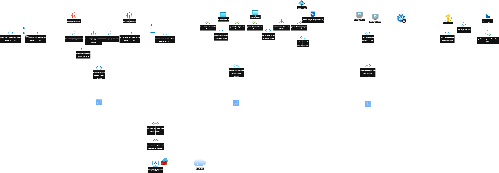
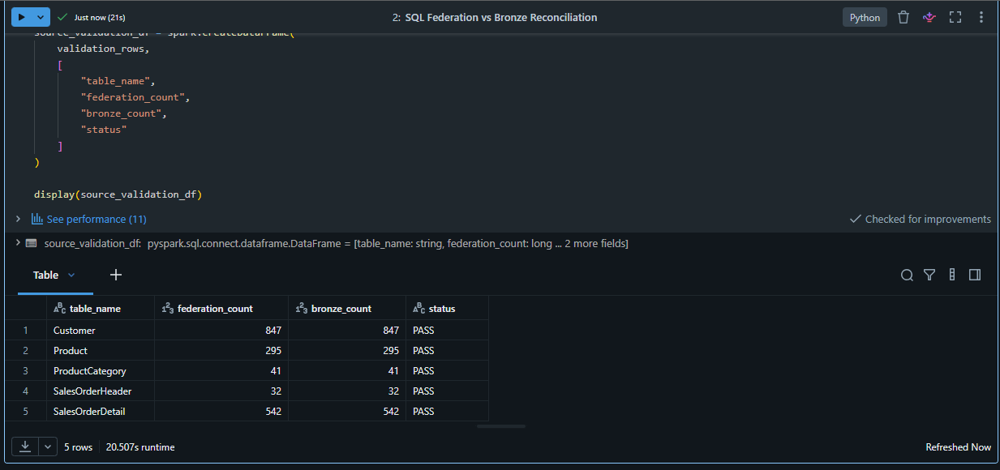
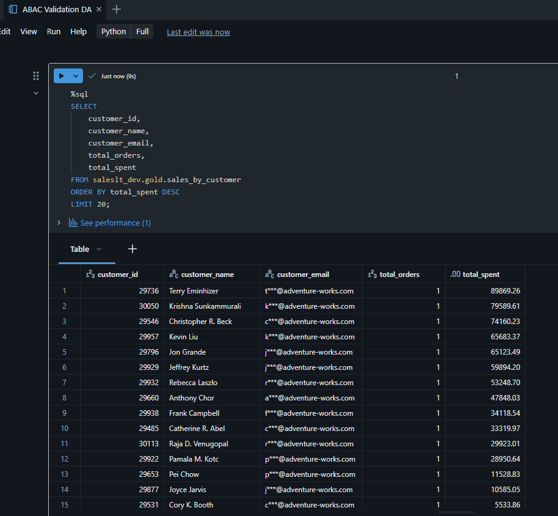
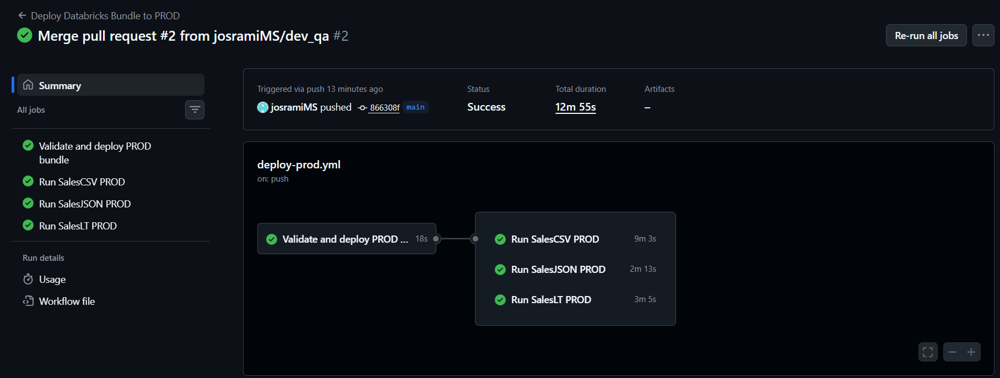
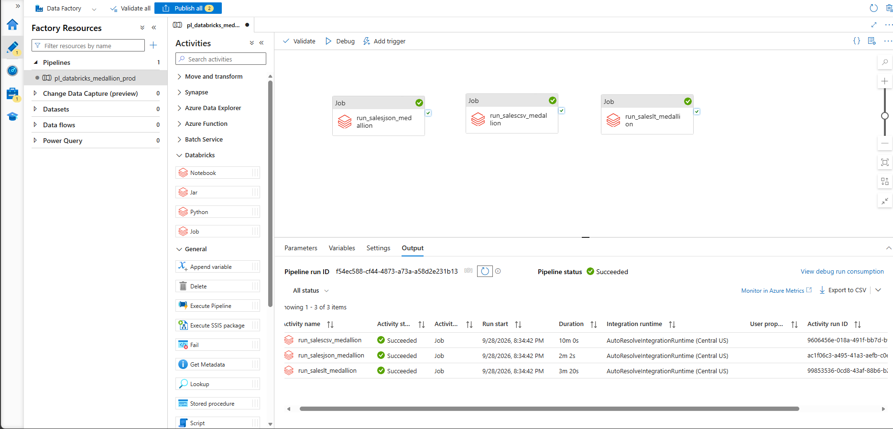
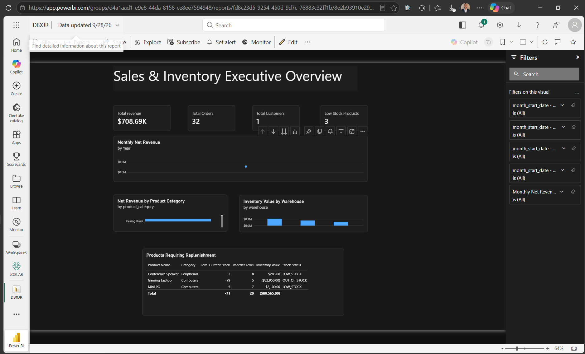
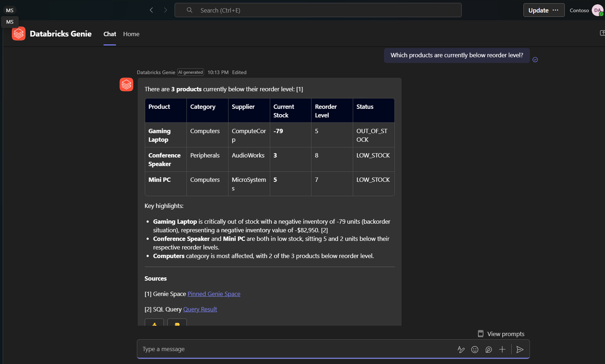
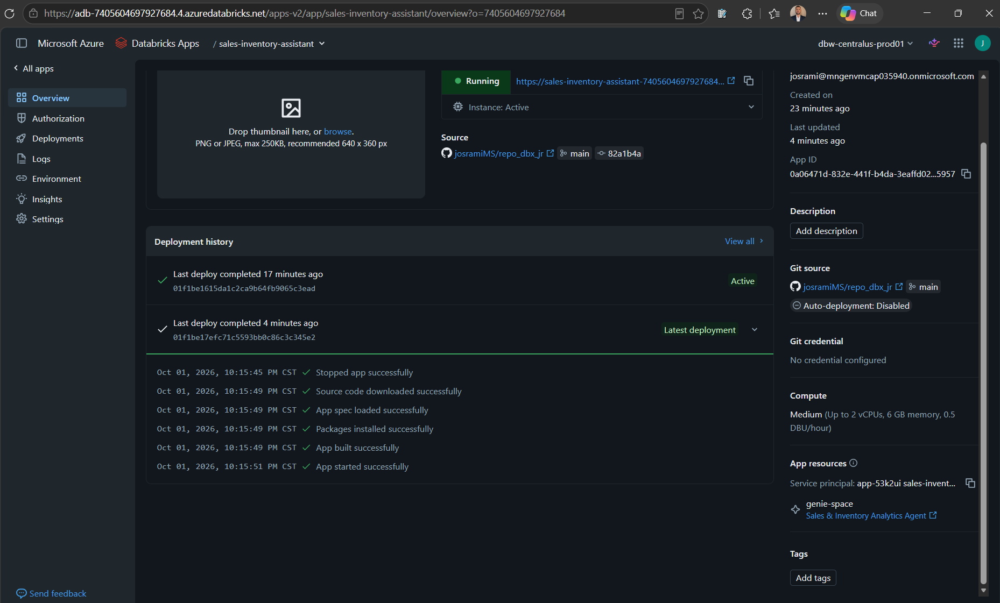
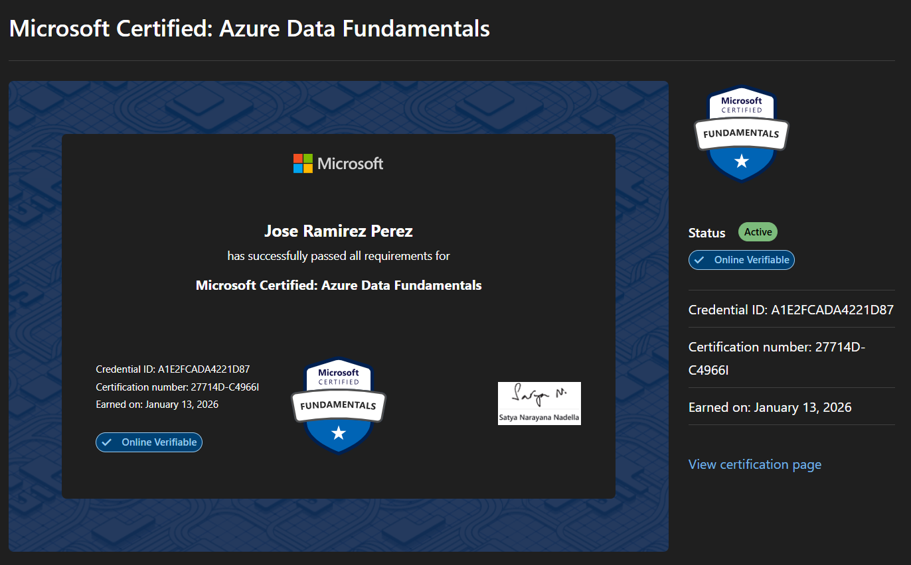
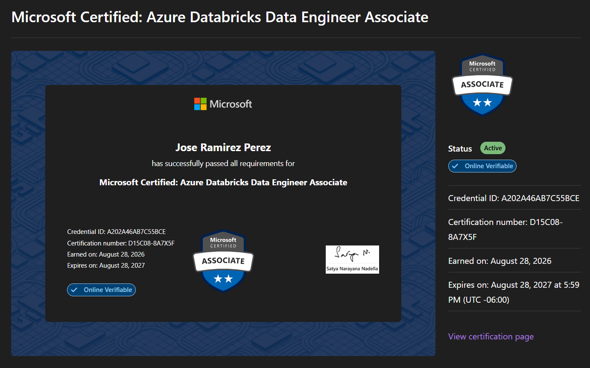

# Guía de evaluación — Proyecto Lakehouse en Azure Databricks

[README completo en español](README_ES.md) · [English version](README.md) · [Índice de evidencias](evidence/README.md)

**Estado de la entrega: COMPLETO.** El proyecto implementa y demuestra un lakehouse gobernado con separación DEV/PROD, tres pipelines Medallion, seguridad en Unity Catalog, automatización, despliegue PROD, orquestación ADF y múltiples canales de consumo. La Databricks App es una extensión bonus adicional al alcance principal.

## Resumen para evaluación

| Área | Evidencia de cumplimiento | Clasificación |
|---|---|---|
| Arquitectura Azure DEV/PROD | Workspaces, ADLS, Access Connectors, redes, private endpoints, Private DNS y recursos por ambiente | **Requisito principal — completo** |
| Ingesta y Medallion | SalesJSON, SalesCSV y SalesLT con Bronze/Silver/Gold, calidad y reconciliación | **Requisito principal — completo** |
| Gobierno y seguridad | Unity Catalog, external locations, grupos/SPs, mínimo privilegio y ABAC | **Requisito principal — completo** |
| Automatización | Bundle `dbx-medallion-automation`, Jobs, reintentos, GitHub Actions y OIDC | **Requisito principal — completo** |
| Producción | Promoción `dev_qa -> PR -> main`, validate/deploy y ejecuciones PROD exitosas | **Requisito principal — completo** |
| Orquestación | ADF v2 ejecuta los tres Jobs PROD en paralelo con Managed Identity | **Requisito principal — completo** |
| BI | Dashboard ejecutivo publicado en Power BI Service desde Gold PROD | **Requisito principal — completo** |
| Analítica conversacional | Genie Agent gobernado y consumo desde Microsoft Teams | **Valor adicional — completo** |
| Aplicación de datos | Streamlit Databricks App sobre el Genie Agent, desplegada en PROD desde `main` | **Bonus — completo** |

## Arquitectura y separación de ambientes

*El diagrama muestra la separación de workspaces, redes, datos, private endpoints, DNS, Azure SQL, ADF y servicios compartidos.*

| Recurso | DEV | PROD |
|---|---|---|
| Databricks | `dbw-centralus-dev01` | `dbw-centralus-prod01` |
| ADLS Gen2 | `stcentralusjrdev` | `stcentralusjrprod` |
| Access Connector | `dbac-centralus-dbx-dev` | `dbac-centralus-dbx-prod` |
| Storage credential | `dbac_centralus_dbx_dev` | `dbac_centralus_dbx_prod` |
| External locations | `ext_landing_dev`, `ext_lakehouse_dev`, `ext_streaming_dev` | `ext_landing_prod`, `ext_lakehouse_prod`, `ext_streaming_prod` |
| Catálogos | `salesjson_dev`, `salescsv_dev`, `saleslt_dev` | `salesjson_prod`, `salescsv_prod`, `saleslt_prod` |
| Catálogo federado SalesLT | `fc_saleslt_dev` | `fc_saleslt_prod` |
| Orquestador superior | — | `adf-centralus-prod` |

La arquitectura separa responsabilidades en tres planos:

- **Control:** GitHub/OIDC despliega recursos versionados; ADF inicia los Jobs mediante su Managed Identity.
- **Datos y gobierno:** Databricks transforma ADLS y Azure SQL a Delta Bronze/Silver/Gold bajo Unity Catalog.
- **Consumo:** SQL Warehouse sirve Gold a Power BI y Genie; Teams y la Databricks App reutilizan el mismo Agent gobernado.

El diagrama incluye VNets/subnets por ambiente, peering, private endpoints y Private DNS. ADLS usa endpoints privados `dfs`/`blob`; Azure SQL tiene acceso público deshabilitado y SalesLT usa NCC/private endpoint desde Serverless. Alcance de red y autorización de datos se controlan por separado.

## Implementación de datos

### SalesJSON — Auto Loader y evolución de esquema

- Fuente reproducible: 15 archivos JSON, 150 órdenes.
- Bronze Serverless con Auto Loader, Managed File Events, checkpoints, metadata de archivo, `_rescued_data`, `availableNow` y evolución aditiva.
- Silver tipifica/deduplica y separa **146 válidas + 4 rechazadas**.
- Gold produce tres agregados; ingreso Silver = Gold = **237,057.40 (PASS)**.
- Notebooks: `process/salesjson/`; evidencia: `evidence/Medallion/salesjson/`.

### SalesCSV — PySpark batch en Job Compute clásico

- Fuente reproducible: 15 productos + 500 movimientos.
- Bronze/Silver/Gold en single-node DBR 17.3 LTS, Photon, `Standard_D4ds_v4`.
- Silver hace LEFT JOIN con productos, calcula cambios firmados y separa **496 válidas + 4 rechazadas**.
- Gold produce inventario por producto, por bodega y bajo stock; unidades, valor y regla de negocio **PASS**.
- Notebooks: `process/salescsv/`; evidencia: `evidence/Medallion/salescsv/`.

### SalesLT — Lakehouse Federation privada

- Fuente Azure SQL con acceso público deshabilitado.
- Conexión federada mediante `sp-centraulus-azsql`; acceso Serverless por NCC/private endpoint.
- Bronze materializa snapshots Delta de cinco tablas; todos los conteos federación-Bronze coinciden.
- Silver crea clientes, productos y líneas de venta; Gold crea tres modelos analíticos.
- Ingreso Silver = Gold por producto = Gold mensual = **708,690.07 (PASS)**.

## Gobierno, seguridad e identidades

`security/00_unity_catalog_grants.ipynb` implementa el baseline: developers trabajan en DEV, analysts consultan solo Gold y el service principal ETL opera las capas necesarias sin ownership de catálogos ni acceso directo al storage credential. Developers no tienen acceso directo a PROD.

`security/01_abac_policies.ipynb` demuestra controles a nivel de dato mediante governed tags:

| Control | Resultado para analyst |
|---|---|
| Column mask sobre `customer_email` | Se conserva primera letra/dominio y se oculta el resto |
| Row filter sobre `country` | Solo Costa Rica: **34 filas**, frente a **92** para identidad privilegiada |

Separación de identidades:

- Access Connectors: acceso ADLS detrás de Unity Catalog.
- `sp-centraulus-azsql`: autenticación de la fuente Azure SQL.
- `sp-centraulus-dbx-main`: `run_as` de Jobs y deployer OIDC en este alcance académico.
- Managed Identity de ADF: únicamente `CAN MANAGE RUN`; sin grants UC/ADLS.
- Data Analyst: consumo Gold por SQL Warehouse.
- Service principal de la App: `CAN RUN` sobre el Agent y mínimo acceso subyacente requerido.

## Automatización, promoción y PROD

El Bundle define tres Jobs operativos Bronze -> Silver -> Gold y un Job manual de metadata. Los reintentos viven en cada tarea y son seguros por checkpoint o MERGE idempotente. Los triggers DEV fueron probados y quedaron pausados; PROD queda bajo ADF.

~~~text
dev_qa -> PR -> main -> GitHub Actions (Environment prod)
       -> OIDC -> validate -> deploy -> summary
       -> SalesCSV / SalesJSON / SalesLT PROD
~~~

GitHub Actions solicita `id-token: write`, no almacena client secret, usa aprobación del Environment `prod` y despliega desde `main`. Los cuatro Jobs se administran con el Bundle; `Metadata Documentation` ejecuta tres tareas Serverless en paralelo y permanece manual.

## Orquestación ADF

ADF v2 `adf-centralus-prod` ejecuta `pl_databricks_medallion_prod` mediante `ls_databricks_prod`. La Managed Identity del factory y la conexión de control Serverless inician **SalesJSON Medallion**, **SalesCSV Medallion** y **SalesLT Medallion** en paralelo. ADF usa retry `0`; los reintentos se mantienen dentro de los Jobs. El pipeline y los runs correlacionados terminaron en `Succeeded`.

## Consumo y valor de negocio

### Power BI — completo

**Sales & Inventory Executive Overview** consume seis tablas Gold PROD por SQL Warehouse como Data Analyst. Presenta ingresos, órdenes, clientes, bajo stock, tendencia mensual, categoría, inventario por bodega y reposición. Query History confirma `Source=PowerBI`; el reporte está publicado en Power BI Service workspace `DBXJR`.

### Genie y Microsoft Teams — valor adicional completo

El **Sales & Inventory Analytics Agent** usa ocho tablas Gold, 6 example queries, 2 measures y 1 filtro. Sus instrucciones evitan mezclar workloads o inventar relaciones. Se validaron ingresos SalesLT, inventario por bodega, bajo stock y análisis por país. Data Analyst obtuvo en Teams los mismos tres productos de bajo stock con fuentes gobernadas.

### Databricks App — bonus completo

La UI Streamlit `apps/sales_inventory_assistant/` está desplegada y corriendo en PROD desde `main`. Usa `WorkspaceClient()` y el App Resource `genie-space`; no consulta tablas directamente ni contiene tokens/IDs hardcodeados. Mantiene conversación, ofrece cuatro quick prompts y preguntas libres. Query History muestra su service principal invocando el Agent y el SQL Warehouse. La conversación completa está incluida en `evidence/Consumption/DatabricksApp/`.

## Características operativas evaluables

| Característica | Implementación |
|---|---|
| Idempotencia | Delta MERGE en cargas batch/snapshots/agregados; checkpoint en Auto Loader |
| Calidad | Cuarentena con `rejection_reason`; reconciliaciones Bronze/Silver/Gold |
| Evolución | `addNewColumns`, `mergeSchema`, schema state y `_rescued_data` |
| Reintentos | Políticas explícitas por tarea con `retry_on_timeout` |
| Metadata | Notebooks `98_` mediante Job manual separado |
| Validación | Notebooks `99_` para auditoría, fuera de la ruta operativa |
| Seguridad de parámetros | `environment=dev|prod` obligatorio y pasado por target |
| Trazabilidad | PR, workflow, Jobs, ADF, Query History y capturas numeradas |

## Navegación del repositorio

| Ruta | Contenido |
|---|---|
| `prepenv/` | Bootstrap de ambientes, storage, catálogos y ubicaciones |
| `process/<workload>/` | Bronze, Silver, Gold, metadata y validación |
| `security/` | Grants de Unity Catalog y políticas ABAC |
| `resources/` + `databricks.yml` | Definiciones del Bundle y Jobs |
| `.github/workflows/` | Promoción/despliegue PROD con OIDC |
| `apps/sales_inventory_assistant/` | Aplicación Streamlit bonus |
| `evidence/` | Evidencia completa por arquitectura, seguridad, automatización, Medallion y consumo |
| `certs/` | Evidencia de certificaciones Microsoft |

## Certificaciones

### Microsoft Certified: Azure Data Fundamentals

### Microsoft Certified: Azure Databricks Data Engineer Associate

[Validar la credencial Azure Databricks en Microsoft Learn](https://learn.microsoft.com/en-us/users/joseramirezperez-8751/credentials/certification/implementing-data-engineering-solutions-using-azure-databricks?tab=credentials-tab).

## Conclusión de evaluación

Los requisitos centrales están completos y respaldados por código, configuración y evidencia visual. Power BI, Genie, Teams y Databricks App también están completos. La App extiende el proyecto más allá del alcance base sin crear una ruta paralela de datos: reutiliza el Agent, Warehouse, Gold y gobierno existentes.

La colección completa está organizada en [`evidence/`](evidence/README.md); este documento muestra solo las pruebas más representativas.

## Referencias técnicas

- [Auto Loader con file events](https://learn.microsoft.com/en-us/azure/databricks/ingestion/cloud-object-storage/auto-loader/file-events-explained)
- [Unity Catalog y ADLS external locations](https://learn.microsoft.com/en-us/azure/databricks/connect/unity-catalog/cloud-storage/external-locations)
- [Lakehouse Federation](https://learn.microsoft.com/en-us/azure/databricks/query-federation/)
- [Conectividad privada de Serverless](https://learn.microsoft.com/en-us/azure/databricks/security/network/serverless-network-security/serverless-private-link)
- [Declarative Automation Bundles](https://learn.microsoft.com/en-us/azure/databricks/dev-tools/bundles/)
- [Databricks Apps con Genie Agent Resource](https://learn.microsoft.com/en-us/azure/databricks/dev-tools/databricks-apps/genie)
