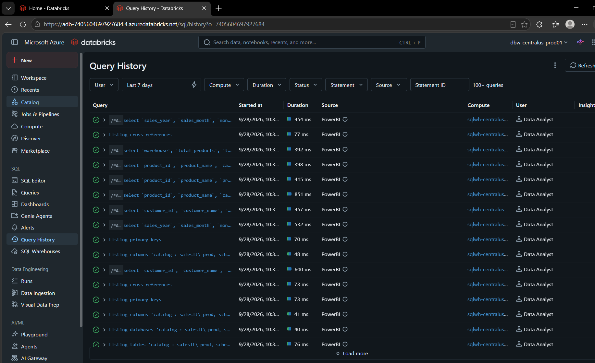
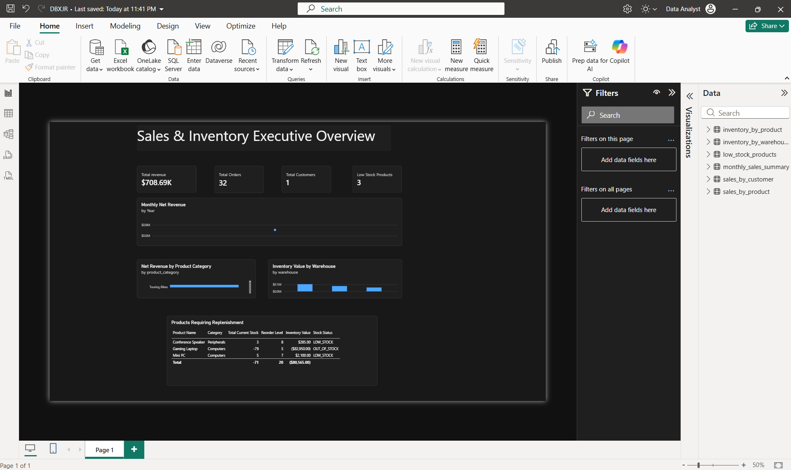
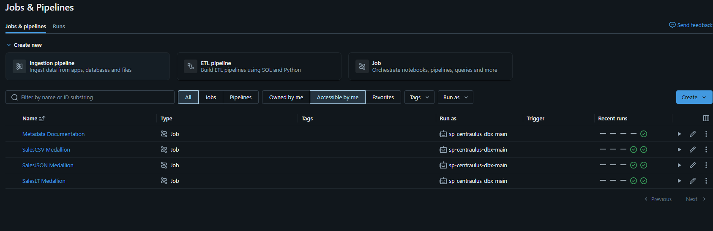
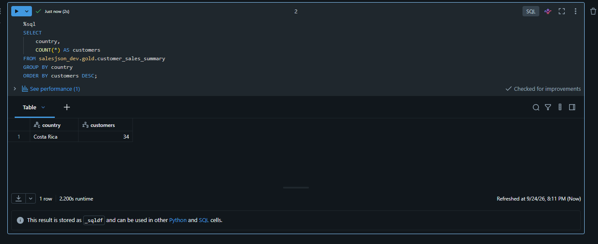
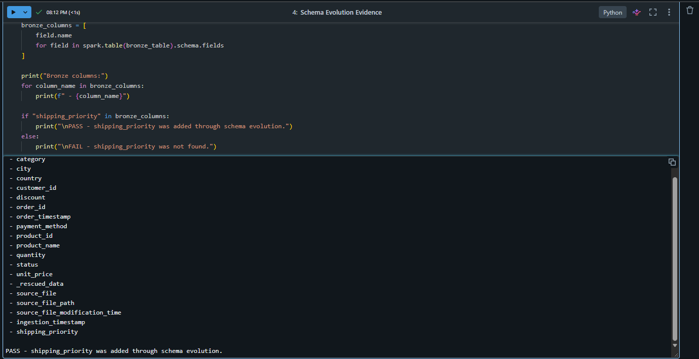

# Guía Concisa de Evaluación — Proyecto Databricks

[README técnico en inglés](README.md) | [Documentación completa en español](README_ES.md)

## Resumen ejecutivo

El proyecto implementa una arquitectura lakehouse gobernada en Azure Databricks. DEV está completo con grants de Unity Catalog, ABAC, los tres ETL, Databricks Bundles y evidencias. La fundación, catálogos, grants y ABAC de PROD también están completos; ABAC PROD se aplicó y validó manualmente. GitHub Actions despliega mediante OIDC sin client secret y con aprobación obligatoria del Environment **prod**. ADF v2 **adf-centralus-prod** ejecuta en paralelo los tres Jobs operativos de PROD mediante **pl_databricks_medallion_prod**; el primer pipeline end-to-end y los runs correlacionados en Databricks terminaron correctamente. El dashboard **Sales & Inventory Executive Overview** ya consume Gold PROD mediante el SQL Warehouse como Data Analyst y está publicado en Power BI Service. Quedan el Genie Agent, la Databricks App opcional y el cierre final de evidencias/limpieza.

~~~text
15 JSON files / 150 Bronze rows
                 |
                 v
146 valid Silver rows + 4 rejected rows
                 |
                 v
3 external Gold Delta tables
                 |
                 v
Silver revenue 237057.40 = Gold revenue 237057.40 (PASS)
~~~

~~~text
Sales CSV: 15 productos + 500 transacciones Bronze
           -> 496 válidas + 4 rechazadas Silver
           -> 3 modelos Gold
           -> unit/value/low-stock validations: PASS
~~~

~~~text
SalesLT: Azure SQL privado -> fc_saleslt_dev -> 5 Bronze snapshots
         -> 847 customers + 295 products + 542 sales lines en Silver
         -> 3 modelos Gold
         -> 708690.07 = 708690.07 = 708690.07: PASS
~~~

## Mapa rápido de evaluación

| Criterio | Implementación | Evidencia | Estado |
|---|---|---|---|
| DEV/PROD separados | Workspaces, storages y Access Connectors separados | **00_environment_setup.ipynb** | Fundaciones DEV y PROD completas |
| Managed Identity | Access Connectors y Storage Credentials | External Locations landing/lakehouse/streaming | DEV y PROD completos |
| Unity Catalog | Catálogos por workload; schemas bronze/silver/gold | Notebook de ambiente | Catálogos y grants DEV/PROD completos |
| Control de acceso | Developers R/W/Create en DEV; Analysts solo Gold; ETL SP mínimo | **00_unity_catalog_grants.ipynb** | Validado con SHOW GRANTS |
| ABAC: column mask | Governed tag **data_classification** sobre SalesLT Gold según ambiente | **01_abac_policies** + **evidence/Security/ABAC/** | Validado en DEV y aplicado/validado manualmente en PROD |
| ABAC: row filter | Governed tag **data_classification** sobre SalesJSON Gold según ambiente | **01_abac_policies** + **evidence/Security/ABAC/** | Validado en DEV y aplicado/validado manualmente en PROD |
| Dataset incremental | 15 archivos NDJSON | **datasets/salesjson/** | Completo |
| Auto Loader | cloudFiles, Managed File Events, availableNow | Notebook Bronze | Validado |
| Checkpoint/schema | Rutas separadas en streaming | Notebook y evidencia | Validado |
| Schema evolution | shipping_priority; addNewColumns + mergeSchema | Evidencia | Validado en DEV; PROD admite el schema base actual |
| Calidad Silver | Casts, reglas y rejected_orders | Notebook Silver | 146 válidos / 4 rechazados |
| Idempotencia | Delta MERGE por order_id y timestamp | Notebook Silver | Implementado |
| Gold | Resúmenes daily/category/customer | Notebook Gold | Completo |
| Reconciliación | Silver net_amount contra Gold net_revenue | Notebook Validation | PASS |
| CSV Bronze | PySpark batch, header=true, inferSchema=true, external Delta, idempotent MERGE | Notebook y external tables evidence | 15 productos / 500 transacciones |
| CSV Silver | explicit casting, try_cast, LEFT JOIN, data-quality rules y rejected_transactions | Notebook y rejected records evidence | 496 válidos / 4 rechazados |
| CSV Gold | inventory_by_product, inventory_by_warehouse y low_stock_products | Notebooks y Gold table evidence | Completo |
| CSV reconciliación | Units, inventory value y low-stock business rule | Notebook Validation y evidence/Medallion/salescsv/ | PASS |
| CSV metadata | Table/column comments en inglés | 98_metadata_documentation.ipynb | Completo |
| SalesLT conectividad | Azure SQL con public access disabled; Foreign Catalog **fc_saleslt_dev**; SP **sp-centraulus-azsql**; NCC + Private Endpoint; Serverless | Configuración ejecutada y evidencias del ETL | Validado en DEV |
| SalesLT Bronze | Snapshot replication de 5 tablas federadas a external Delta | 01_bronze_ingestion + reconciliación SQL/Bronze | 5/5 PASS |
| SalesLT Silver | customers/products/sales_order_lines; joins y moneda a 2 decimales | 02_silver_transformation + evidencia de join | 847 / 295 / 542 |
| SalesLT Gold | sales_by_product, sales_by_customer, monthly_sales_summary; aggregations y ranking | 03_gold_analytics + outputs | Completo |
| SalesLT reconciliación | Silver, Product Gold y Monthly Gold | 99_phase_validation + evidence/Medallion/saleslt/ | 708690.07 en las 3 capas; PASS |
| CI/CD | `deploy-prod.yml`; GitHub OIDC sin client secret; Environment `prod` con Required Reviewer | GitHub Actions + `evidence/Automation/GitHubActions/` | PROD exitoso |
| Jobs PROD | Tres ETL operativos más Metadata Documentation; sin triggers PROD | Jobs overview y workflow completo | 4/4 desplegados; los cuatro con ejecución exitosa |
| Seguridad de parámetros | Widgets de ambiente con default vacío y validación exacta `dev`/`prod` | 18 notebooks parametrizados | Ejecución manual sin fallback silencioso a DEV |
| Metadata PROD | Job `metadata_documentation`, tres tareas Serverless paralelas, manual, sin trigger y `run_as` del SP | `resources/metadata.job.yml` + `evidence/Automation/Metadata/README.md` | Desplegado y ejecutado con `environment=prod` |
| Orquestación ADF PROD | ADF v2 `adf-centralus-prod`; pipeline `pl_databricks_medallion_prod`; linked service `ls_databricks_prod` con System-assigned Managed Identity | `evidence/Automation/ADF/` | 3 Jobs en paralelo y pipeline SUCCESS |
| Separación de identidades ADF | ADF tiene `CAN MANAGE RUN` en 3 Jobs; sin grants UC/ADLS. Jobs conservan `run_as=sp-centraulus-dbx-main` | Bundle + permisos de Jobs + evidencia ADF | Validado |
| Consumo Power BI | Desktop/Service -> Databricks SQL Warehouse -> Unity Catalog Gold PROD; acceso Data Analyst | `evidence/Consumption/PowerBI/` | Dashboard publicado y Query History validado; COMPLETE |

## Recursos

| Recurso | DEV | PROD |
|---|---|---|
| Workspace | **dbw-centralus-dev01** | **dbw-centralus-prod01** |
| Storage | **stcentralusjrdev** | **stcentralusjrprod** |
| Access Connector | **dbac-centralus-dbx-dev** | **dbac-centralus-dbx-prod** |
| Orquestador superior | No configurado | ADF v2 **adf-centralus-prod** |
| Storage Credential | **dbac_centralus_dbx_dev** | **dbac_centralus_dbx_prod** |
| Catálogos | saleslt_dev, salesjson_dev, salescsv_dev | saleslt_prod, salesjson_prod, salescsv_prod |
| External Locations | ext_landing_dev, ext_lakehouse_dev, ext_streaming_dev | ext_landing_prod, ext_lakehouse_prod, ext_streaming_prod |

~~~text
landing     -> archivos fuente
lakehouse   -> tablas Delta externas y managed roots
streaming   -> schemas y checkpoints de Auto Loader
~~~

Los Access Connectors usan Managed Identity. Los nombres técnicos y comentarios de Unity Catalog se mantienen en inglés.

## Seguridad

| Principal | Acceso |
|---|---|
| **admins** | Administración y ownership. |
| **grp-dbx-developers** | DEV: USE, CREATE TABLE, SELECT, MODIFY y External Locations requeridas. PROD: sin acceso directo. |
| **grp-dbx-analysts** | USE y SELECT únicamente en Gold. |
| **sp-centraulus-dbx-main** | `run_as` de los Jobs DEV/PROD y, en este proyecto académico, deploy identity de GitHub OIDC para PROD; no usa client secret almacenado. |
| **sp-centraulus-azsql** | Identidad de la conexión federada Azure SQL / SalesLT en DEV. |
| Managed Identity system-assigned de **adf-centralus-prod** | Solo control de ejecución: `CAN MANAGE RUN` sobre los tres Jobs PROD; sin acceso de data plane en Unity Catalog ni ADLS. |

El ETL SP no recibe CREATE CATALOG, CREATE SCHEMA, MANAGE, OWNERSHIP ni acceso directo al Storage Credential.

En PROD, developers no reciben grants; analysts consumen únicamente Gold y el Service Principal del ETL ejecuta las cargas.

### ABAC validado en DEV y PROD

El baseline de grants se conserva en **security/00_unity_catalog_grants.ipynb**. La tarea de notebook **security/01_abac_policies.py**, versionada en el repositorio como **security/01_abac_policies.ipynb**, implementa dos políticas controladas por el governed tag **data_classification**:

| Política | Resultado observado |
|---|---|
| Column mask en **saleslt_dev.gold.sales_by_customer.customer_email** para **grp-dbx-analysts** | Admin/developer ve el email normal; analyst lo ve enmascarado. |
| Row filter en **salesjson_dev.gold.customer_sales_summary.country** para **grp-dbx-analysts** | Admin ve Costa Rica **34**, United States **24**, Mexico **19** y Colombia **15**: **92 total**. Analyst ve solo Costa Rica: **34**. |

Las evidencias de grants y ABAC están separadas en **evidence/Security/UC_GRANTS/** y **evidence/Security/ABAC/**. Security DEV queda completada con grants + ABAC. La misma definición portable se aplicó y validó manualmente en PROD sin conceder acceso interactivo a developers.

## ETL Sales JSON

Las cifras y evidencias de **shipping_priority** de esta sección corresponden a DEV. El dataset actual de PROD contiene solo los cinco archivos JSON con schema base, por lo que puede operar sin esa columna.

Bronze:

- Auto Loader + Structured Streaming sobre **landing/salesjson/incoming/**.
- ADLS mediante Managed Identity y ejecución Serverless a través del NCC configurado.
- Managed File Events, schema location, checkpoint, rescued data y file metadata.
- addNewColumns, Delta mergeSchema y availableNow=True.
- Target externo **salesjson_dev.bronze.orders_raw**.

Silver:

- Targets **silver.orders** y **silver.rejected_orders**.
- Normalización, casts, métricas gross/discount/net y reglas de calidad.
- Deduplicación por order_id.
- Delta MERGE con schema evolution e idempotencia por ingestion timestamp.

Gold:

| Tabla | Filas | Uso |
|---|---:|---|
| **daily_sales_summary** | **20** | Serie temporal y métricas de ventas. |
| **category_sales_summary** | **3** | Rendimiento por categoría. |
| **customer_sales_summary** | **92** | Actividad y valor por cliente/país. |

Las tablas Gold son Delta externas, leen solo desde Silver y usan snapshot-style MERGE.

## ETL Sales CSV

Fuente:

- ADLS Gen2 mediante Managed Identity.
- **product_catalog.csv**: 15 registros.
- **inventory_transactions.csv**: 500 registros.

Bronze:

- PySpark batch con **header=true** e **inferSchema=true**.
- Targets externos **product_catalog_raw** e **inventory_transactions_raw**.
- Idempotent Delta MERGE.

Silver:

- explicit casting, **try_cast** y **LEFT JOIN** con product catalog.
- Data-quality rules: **496 válidos / 4 rechazados**.
- Métricas **inventory_change** e **inventory_value_change**.
- Delta MERGE y cuarentena en **rejected_transactions**.

Gold:

- **inventory_by_product**, **inventory_by_warehouse** y **low_stock_products**.
- **GROUP BY**, **COUNT DISTINCT**, **SUM**, **AVG**, **MIN** y **MAX**.
- Business filtering y snapshot MERGE.

Metadata y validación:

- **process/salescsv/98_metadata_documentation.ipynb** documenta en inglés tables y columns para consumo técnico y Genie.
- **process/salescsv/99_phase_validation.ipynb** confirma unit reconciliation, inventory value reconciliation y low-stock business rule: **PASS**.

## ETL SalesLT

Conectividad y ejecución:

- Azure SQL con public access disabled.
- Lakehouse Federation Foreign Catalog **fc_saleslt_dev**.
- Connection autenticada con **sp-centraulus-azsql**.
- Conectividad privada mediante NCC + Private Endpoint.
- Ejecución en Databricks Serverless compute.

Bronze:

- Snapshot replication a cinco tablas Delta externas.
- Reconciliación fuente/Bronze: Customer **847**, Product **295**, ProductCategory **41**, SalesOrderHeader **32**, SalesOrderDetail **542**; todas **PASS**.

Silver:

- **customers** (**847**), **products** (**295**) y **sales_order_lines** (**542**).
- Joins entre headers, details, customers, products y categories.
- Normalización y monetary precision a dos decimales para analytics.

Gold:

- **sales_by_product**, con aggregations y revenue ranking.
- **sales_by_customer**, con actividad, productos y gasto.
- **monthly_sales_summary**, con métricas mensuales.
- Reconciliación: Silver **708690.07** = Product Gold **708690.07** = Monthly Gold **708690.07**: **PASS**.

Metadata y validación:

- **process/saleslt/98_metadata_documentation.ipynb** documenta tables y columns.
- **process/saleslt/99_phase_validation.ipynb** valida snapshots, Silver, Gold y reconciliación.

## Patrón común de los tres ETL

~~~text
01_bronze_ingestion.py
02_silver_transformation.py
03_gold_analytics.py
98_metadata_documentation.py
99_phase_validation.py
~~~

En el repositorio se conservan como notebooks **.ipynb** bajo **process/salesjson/**, **process/salescsv/** y **process/saleslt/**.

## Evidencias

Carpeta: **evidence/Medallion/salesjson/**

- Bronze 150, Silver válido 146 y rechazado 4.
- Source files y checkpoint de Auto Loader.
- Schema evolution con shipping_priority en DEV; PROD admite el schema base actual de cinco archivos.
- Cuatro reglas de rechazo, una fila por regla.
- Resultados de las tres tablas Gold.
- Silver 237057.40 = Gold 237057.40: PASS.

Carpeta: **evidence/Medallion/salescsv/**

- Product Bronze 15 e Inventory Bronze 500.
- Silver válido 496 y rechazado 4.
- Join enrichment y external Delta tables.
- Gold product 15, Gold warehouse 3 y salida low stock.
- Unit reconciliation, inventory value reconciliation y low-stock business rule: PASS.

Carpeta: **evidence/Medallion/saleslt/**

- Conteos Azure SQL Federation contra Bronze para las cinco tablas: PASS.
- Silver summary y evidencia de joins.
- Outputs de **sales_by_product**, **sales_by_customer** y **monthly_sales_summary**.
- Reconciliación 708690.07 en Silver, Product Gold y Monthly Gold: PASS.

Seguridad:

- **evidence/Security/UC_GRANTS/**: baseline de permisos y External Locations.
- **evidence/Security/ABAC/**: configuración de policies, email con/sin mask y row filter con admin/developer versus analyst.

Automatización:

- **evidence/Automation/Bundles/**: validación, deploy, summary, retries y triggers `PAUSED` de DEV.
- **evidence/Automation/GitHubActions/**: protección del Environment `prod`, CI/CD exitoso, despliegue en workspace y Jobs PROD.
- **evidence/Automation/Metadata/**: estado confirmado del Job manual de metadata y checklist de capturas detalladas que faltan por recopilar.
- **evidence/Automation/ADF/**: pipeline PROD exitoso y runs correspondientes verificados en Databricks.

Consumo:

- **evidence/Consumption/PowerBI/**: Query History con `Source=PowerBI` y `User=Data Analyst`, dashboard terminado en Desktop y reporte publicado en el workspace **DBXJR** de Power BI Service.

Solo se muestran capturas representativas; el resto del conjunto normalizado está organizado bajo **evidence/Medallion/**, **evidence/Security/**, **evidence/Automation/** y **evidence/Consumption/**. El índice corto está en **evidence/README.md**.

Query History de Databricks confirma solicitudes de Power BI mediante el SQL Warehouse PROD como Data Analyst:

Dashboard terminado en Power BI Desktop:

Reporte publicado en el workspace DBXJR de Power BI Service:

Despliegue PROD exitoso en GitHub Actions:

Pipeline ADF con los tres Jobs paralelos en estado exitoso:

Los cuatro Jobs PROD administrados por el Bundle:

Email enmascarado para la identidad analyst mediante ABAC:

Row filter de país aplicado a la identidad analyst:

Schema evolution validado en Sales JSON:

Reconciliación de las cinco tablas entre SQL Federation y Bronze:

## Automatización DEV y PROD

[Databricks Declarative Automation Bundles](https://docs.databricks.com/aws/en/dev-tools/bundles/jobs-tutorial) define tres Jobs ETL y un Job manual de metadata reutilizados por ambos targets. Los Jobs ETL ejecutan Bronze -> Silver -> Gold con `environment=dev|prod`, un ingestion timestamp común y `run_as` **sp-centraulus-dbx-main**. El Job de metadata pasa el mismo ambiente del target a sus tres notebooks 98. Los widgets fuente tienen default vacío, así que las ejecuciones manuales requieren seleccionar explícitamente `dev` o `prod`; los Jobs no cambian de comportamiento porque envían el parámetro desde el Bundle. DEV se desplegó interactivamente con **josrami**. Para este proyecto académico, **sp-centraulus-dbx-main** también es la identidad de despliegue de GitHub OIDC en PROD.

~~~text
.github/workflows/deploy-prod.yml
databricks.yml
resources/
├── metadata.job.yml
├── salesjson.job.yml
├── salescsv.job.yml
└── saleslt.job.yml
evidence/Automation/
├── ADF/
│   └── README.md
├── Bundles/
├── GitHubActions/
│   └── README.md
└── Metadata/
    └── README.md
~~~

- **salesjson_medallion**: Serverless Jobs. Bronze tiene 2 retries con intervalo de 30 s; Silver y Gold, 1 retry con 30 s.
- **salescsv_medallion**: classic single-node Job Compute con DBR 17.3 LTS, `Standard_D4ds_v4`, Photon, Standard access mode, `num_workers: 0` y sin autoscaling. Todas las tareas tienen 1 retry con intervalo de 30 s.
- **saleslt_medallion**: Serverless Jobs; la conexión federada usa **sp-centraulus-azsql** y el runtime usa **sp-centraulus-dbx-main**. Bronze tiene 3 retries con intervalo de 60 s; Silver y Gold, 1 retry con 30 s.

Los triggers de DEV se validaron temporalmente y quedaron `PAUSED`. PROD no tiene triggers ni schedules en Databricks porque ADF es el orquestador superior activo.

- **metadata_documentation** / **Metadata Documentation**: tres tareas Serverless paralelas para SalesJSON, SalesCSV y SalesLT. Es manual, no define schedule ni trigger, hereda `run_as` **sp-centraulus-dbx-main** y permite aplicar metadata PROD sin otorgar permisos interactivos de datos PROD a Jose/developers.
- Los notebooks `99_phase_validation` se mantienen para auditoría o troubleshooting por separado y no forman parte de este Job.

### Cierre CI/CD de PROD

El workflow **deploy-prod.yml** corre tras un push a **main** o manualmente. Usa permisos `id-token: write`, autenticación GitHub OIDC sin client secret y el GitHub Environment **prod** con Required Reviewer. La ejecución aprobada completó con éxito:

~~~text
databricks bundle validate -t prod
databricks bundle deploy -t prod
databricks bundle summary -t prod
databricks bundle run -t prod salescsv_medallion
databricks bundle run -t prod salesjson_medallion
databricks bundle run -t prod saleslt_medallion
~~~

Resultado observable:

- Bundle desplegado bajo **/Workspace/prod/ETLs**.
- **SalesJSON Medallion** creado y ejecutado en Serverless.
- **SalesCSV Medallion** creado y ejecutado en classic single-node Job Compute.
- **SalesLT Medallion** creado y ejecutado en Serverless.
- Los tres ETL PROD siguen exitosos y sin triggers PROD.

El PR #3 promovió a `main` el default vacío de los widgets `environment` y `resources/metadata.job.yml`. GitHub Actions volvió a ejecutar el flujo PROD y el Bundle reconcilió/actualizó los recursos existentes. **Metadata Documentation** quedó desplegado como el cuarto Job: manual, sin trigger ni schedule, con tres tareas Serverless paralelas y `run_as` **sp-centraulus-dbx-main**. El Job se ejecutó correctamente con `environment=prod` recibido desde el target, sin otorgar permisos interactivos PROD a Jose ni al grupo developers. Los notebooks 99 siguen separados para auditoría o troubleshooting y fuera del flujo operativo. El checklist de evidencia está en **evidence/Automation/Metadata/README.md**.

### Orquestación PROD con Azure Data Factory

ADF v2 **adf-centralus-prod** usa el pipeline **pl_databricks_medallion_prod** y el linked service **ls_databricks_prod**, creado desde la actividad Databricks Job con la Managed Identity system-assigned del factory y Serverless para la conexión de control.

La identidad de ADF tiene `CAN MANAGE RUN` sobre **SalesJSON Medallion**, **SalesCSV Medallion** y **SalesLT Medallion**, pero no tiene permisos de data plane en Unity Catalog ni ADLS. Los Jobs siguen administrados por el Databricks Bundle y ejecutan como **sp-centraulus-dbx-main**. ADF lanza los tres en paralelo con retry **0**; los retries se mantienen en las tareas de Databricks. **Metadata Documentation** sigue manual y fuera del pipeline. La primera ejecución end-to-end finalizó con las tres actividades y el pipeline global en `Succeeded`, y los runs se correlacionaron en Databricks. **Estado ADF: COMPLETE.**

## Consumo Power BI

**Estado: COMPLETE.** La ruta validada es **Power BI Desktop/Service -> Azure Databricks SQL Warehouse -> Unity Catalog Gold PROD**. La conexión usa la identidad **Data Analyst** con acceso de consumidor sobre Gold, no acceso de developer a PROD. Query History confirma `Source=PowerBI`, el compute del SQL Warehouse PROD y `User=Data Analyst`.

Tablas consumidas:

- `saleslt_prod.gold.monthly_sales_summary`
- `saleslt_prod.gold.sales_by_product`
- `saleslt_prod.gold.sales_by_customer`
- `salescsv_prod.gold.inventory_by_product`
- `salescsv_prod.gold.inventory_by_warehouse`
- `salescsv_prod.gold.low_stock_products`

No se crearon relaciones artificiales entre agregados Gold; cada visual usa la tabla con el grain correcto. **Sales & Inventory Executive Overview** incluye **Total Revenue**, **Total Orders**, **Total Customers**, **Low Stock Products**, **Monthly Net Revenue**, **Net Revenue by Product Category**, **Inventory Value by Warehouse** y **Products Requiring Replenishment**. El reporte fue publicado correctamente en el workspace **DBXJR** de Power BI Service. Copilot no fue necesario.

## Estado de la entrega

- DEV completo: fundación, Unity Catalog grants, ABAC, tres ETL, metadata/validación, evidencia y Bundle con operational hardening.
- PROD completo para esta fase: fundación, catálogos, schemas, grants, ABAC aplicado y validado manualmente, OIDC CI/CD, `bundle validate/deploy/summary`, tres Jobs Bronze-to-Gold exitosos, cleanup de ambiente explícito, **Metadata Documentation** desplegado/ejecutado y orquestación ADF.
- ADF v2 **adf-centralus-prod** ejecuta en paralelo los tres Jobs PROD mediante **pl_databricks_medallion_prod**; pipeline y runs correlacionados exitosos.
- Consumo Power BI completo: dashboard publicado y acceso a Gold PROD validado mediante el SQL Warehouse con Data Analyst.
- El cierre documental se prepara en **dev_qa** y no se hace merge automático a **main**.
- Faltan capturas detalladas de metadata como evidencia, no su despliegue ni ejecución. Los notebooks 99 se ejecutan por separado solo cuando se necesiten para auditoría o troubleshooting.
- Consumo pendiente: Genie Agent y Databricks App opcional; después, cierre final de evidencias/limpieza.
