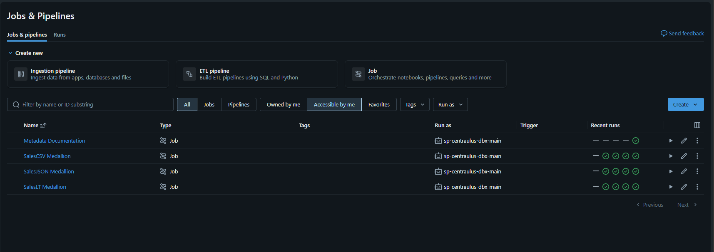

# Evidencia de orquestación PROD con Azure Data Factory

**Estado de fase: COMPLETO.** Azure Data Factory v2 `adf-centralus-prod` es el orquestador superior de PROD. Su Managed Identity inicia en paralelo los tres Jobs Medallion administrados por el Bundle, sin acceso al plano de datos de Unity Catalog o ADLS.

| Captura | Qué demuestra |
|---|---|
| `03_adf_pipeline_success.png` | Las tres actividades de Databricks y el pipeline completo terminaron en estado `Succeeded`. |
| `04_databricks_jobs_triggered_by_adf.png` | Los runs PROD correspondientes aparecieron exitosos en Databricks después de la ejecución ADF. |

## 03 — Pipeline ADF paralelo exitoso

El run demuestra que SalesJSON, SalesCSV y SalesLT se iniciaron en paralelo y completaron correctamente, manteniendo los reintentos dentro de cada Job.

## 04 — Jobs de Databricks iniciados por ADF

El historial correlacionado confirma que ADF inició los tres Jobs PROD desplegados sin duplicar sus definiciones.

[Volver al índice de evidencias](../../README_ES.md) · [View in English](README.md)
