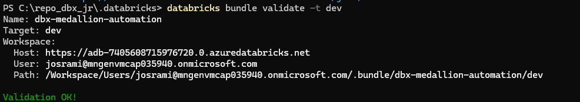
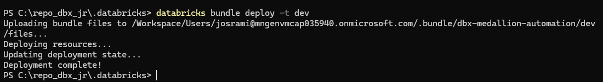
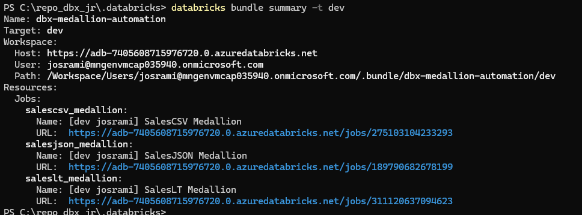
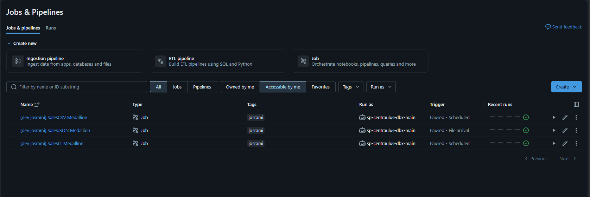
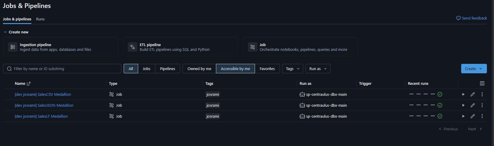
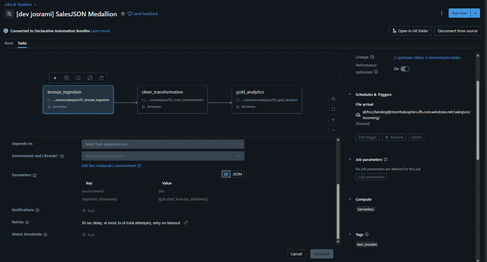
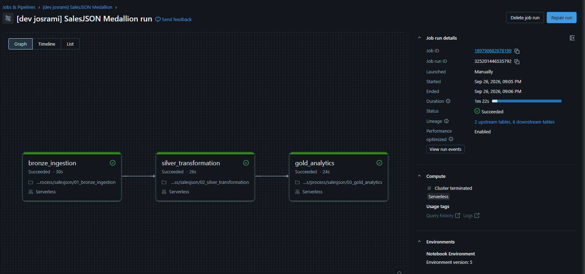
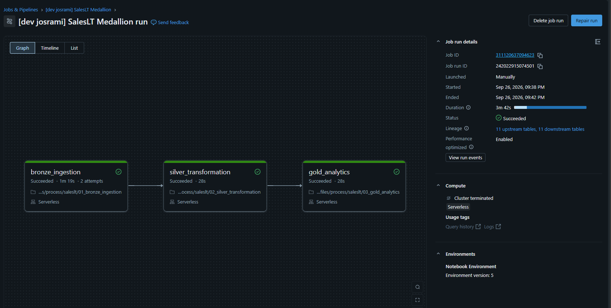

# Evidencia de Declarative Automation Bundles

**Estado de fase: COMPLETO.** Esta carpeta demuestra que el Bundle `dbx-medallion-automation` valida y despliega en DEV, administra los Jobs previstos, usa identidades/triggers/reintentos controlados y completa runs Serverless representativos.

| # | Qué demuestra la captura |
|---|---|
| 01 | Validación exitosa del Bundle en DEV. |
| 02 | Despliegue exitoso del Bundle en DEV. |
| 03 | Target, ruta de workspace y resumen de recursos desplegados. |
| 04 | Inventario de Jobs administrados y estado de triggers. |
| 05 | Resumen de identidad `run_as` de los Jobs. |
| 06 | Configuración de trigger y reintentos de SalesJSON. |
| 07 | Run Serverless exitoso de SalesJSON. |
| 08 | Comportamiento exitoso de run/reintentos Serverless de SalesLT. |

## 01 — Validación del Bundle en DEV

La validación exitosa demuestra que la configuración declarativa resuelve correctamente para el target DEV.

## 02 — Despliegue del Bundle en DEV

El resultado confirma que los recursos versionados se aplicaron al workspace DEV.

## 03 — Resumen del Bundle en DEV

El resumen identifica target, raíz del workspace y recursos administrados después del despliegue.

## 04 — Resumen de Jobs y triggers

El workspace muestra los tres Jobs Medallion operativos y el Job manual Metadata Documentation, con triggers DEV validados y pausados.

## Job de Metadata Documentation

Metadata se incluye intencionalmente aquí porque no existe una carpeta separada de screenshots. El inventario anterior y el resumen del Bundle demuestran que el Job manual está desplegado con los Jobs operativos; sus tres tareas paralelas aplican comentarios de tablas y columnas fuera de la orquestación rutinaria.

## 05 — Identidades run-as de Jobs

El resumen demuestra que los Jobs administrados por el Bundle ejecutan con el service principal previsto.

## 06 — Trigger y política de reintentos de SalesJSON

La configuración registra el trigger por llegada de archivos y los reintentos explícitos, incluido timeout.

## 07 — Run Serverless exitoso de SalesJSON

El run completado demuestra ejecución operativa Bronze-Silver-Gold sobre cómputo Serverless.

## 08 — Run/reintento exitoso de SalesLT

El run demuestra ejecución Serverless exitosa con la política de reintentos disponible para la tarea Bronze federada.

[Volver al índice de evidencias](../../README_ES.md) · [View in English](README.md)
