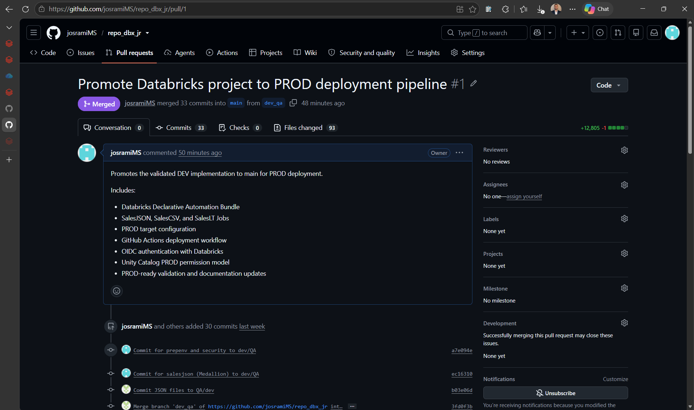
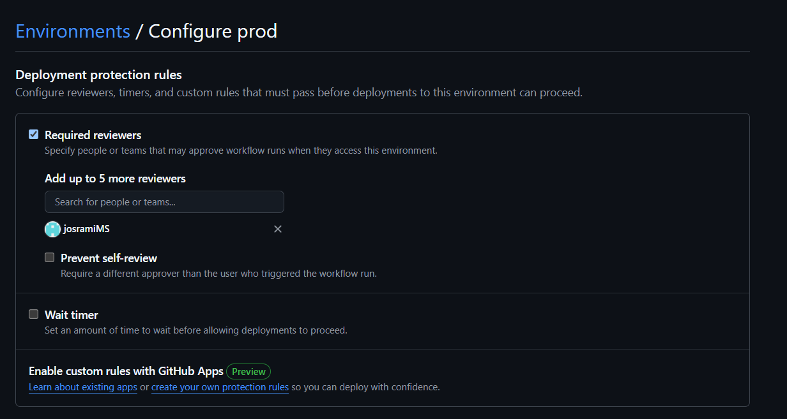
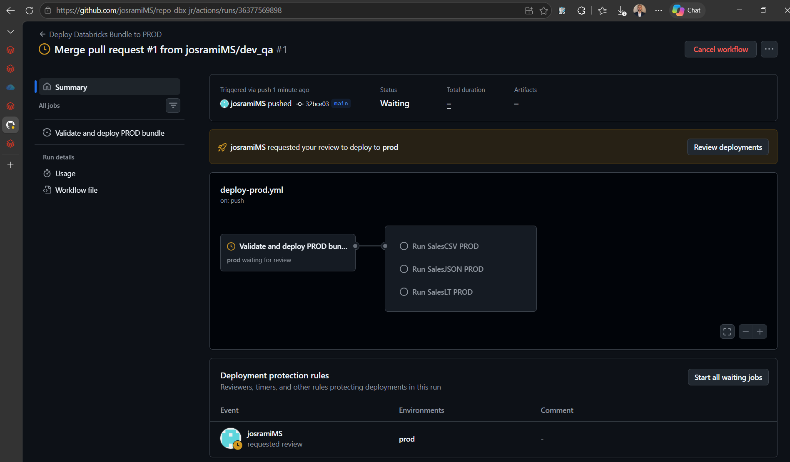
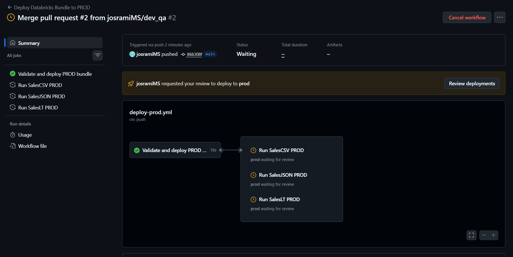
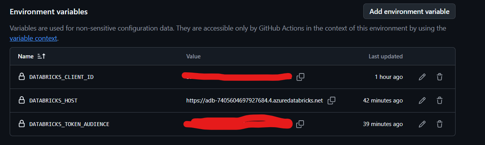
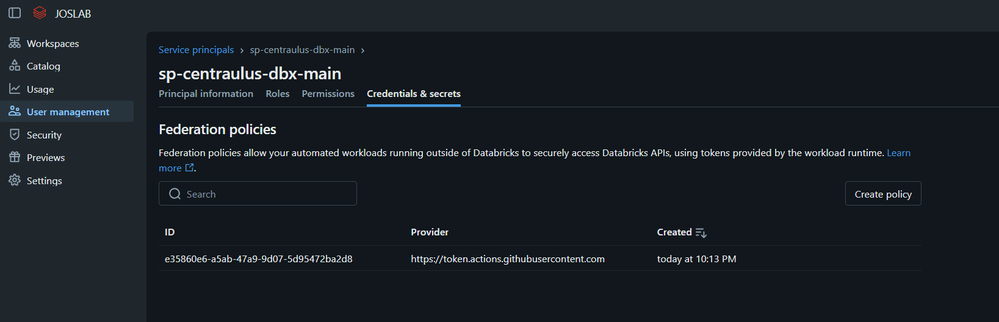
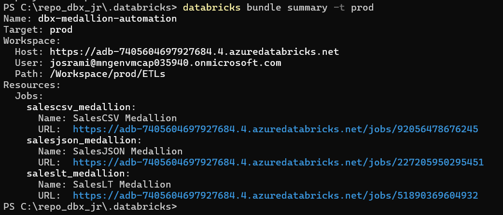
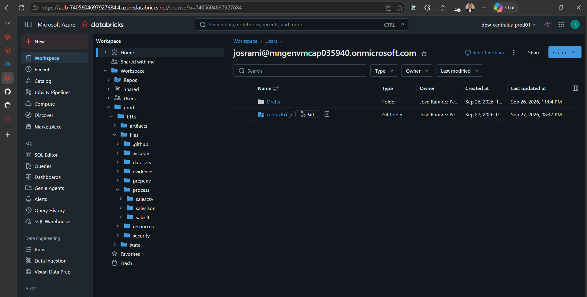

# GitHub Actions PROD CI/CD evidence

**Phase status: COMPLETE.** This folder proves controlled promotion from `dev_qa` to `main`, secretless OIDC authentication, protected PROD approvals, Bundle deployment, successful workload execution, and the resulting workspace resources.

| # | What the screenshot demonstrates |
|---|---|
| 01 | Merged promotion pull request into `main`. |
| 02 | Required reviewer on the protected `prod` Environment. |
| 03 | Initial PROD approval request. |
| 04 | Deployment approval gate before PROD execution. |
| 05 | Non-secret OIDC environment variables with sensitive values redacted. |
| 06 | Databricks federation policy for GitHub OIDC. |
| 07 | Successful validate/deploy and all three PROD workload runs. |
| 08 | PROD Bundle target and resource summary. |
| 09 | Four PROD Jobs, including manual Metadata Documentation. |
| 10 | Bundle files deployed under `/Workspace/prod/ETLs`. |

## 01 — PROD promotion pull request merged

The merged PR records the controlled repository promotion from `dev_qa` into `main`.

## 02 — Protected environment required reviewer

The `prod` Environment requires human approval before the protected deployment can proceed.

## 03 — Initial PROD approval request

The workflow pauses at the expected approval request, preserving deployment history from the protection setup.

## 04 — PROD deployment approval gate

The run shows the approval boundary between deployment preparation and protected PROD execution.

## 05 — OIDC environment variables

The Environment contains only the required non-secret OIDC configuration; sensitive values are redacted and no client secret is used.

## 06 — Databricks OIDC federation policy

The service-principal federation policy trusts the intended GitHub Actions identity and environment context.

## 07 — Successful PROD deployment workflow

The complete workflow is green for Bundle validation/deployment and the SalesJSON, SalesCSV, and SalesLT PROD runs.

## 08 — PROD Bundle summary

The summary confirms the production target, workspace path, and deployed Job identities/IDs.

## 09 — PROD Jobs overview

The workspace contains the three operational Jobs and manual Metadata Documentation Job with the expected `run_as` identity.

## 10 — Deployed Bundle workspace files

The versioned Bundle files are present under `/Workspace/prod/ETLs`, proving the deployed source layout.

[Back to evidence index](../../README.md) · [Ver en español](README_ES.md)
