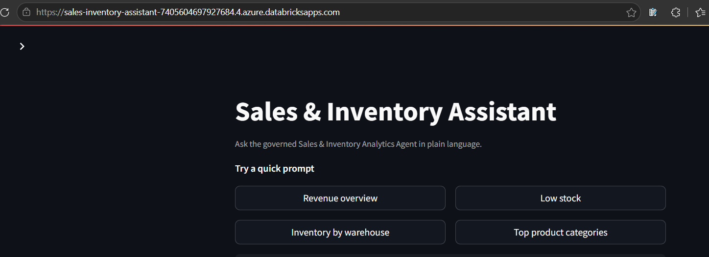
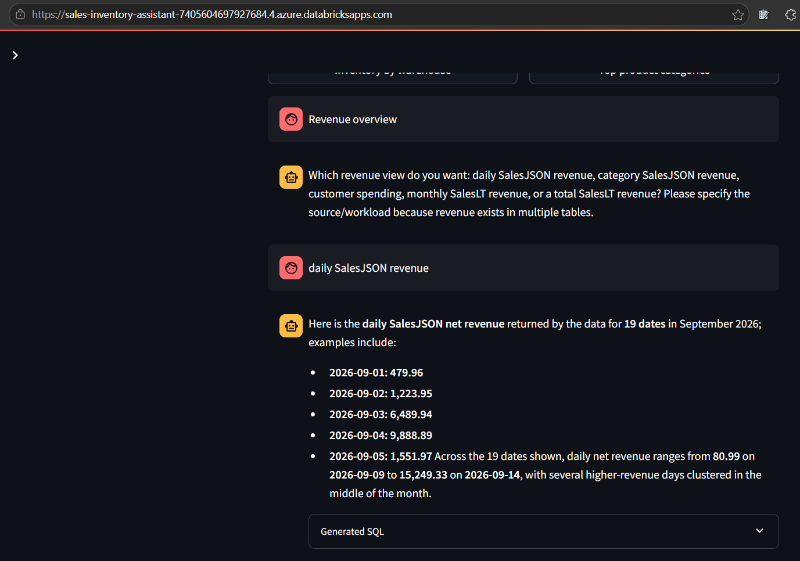
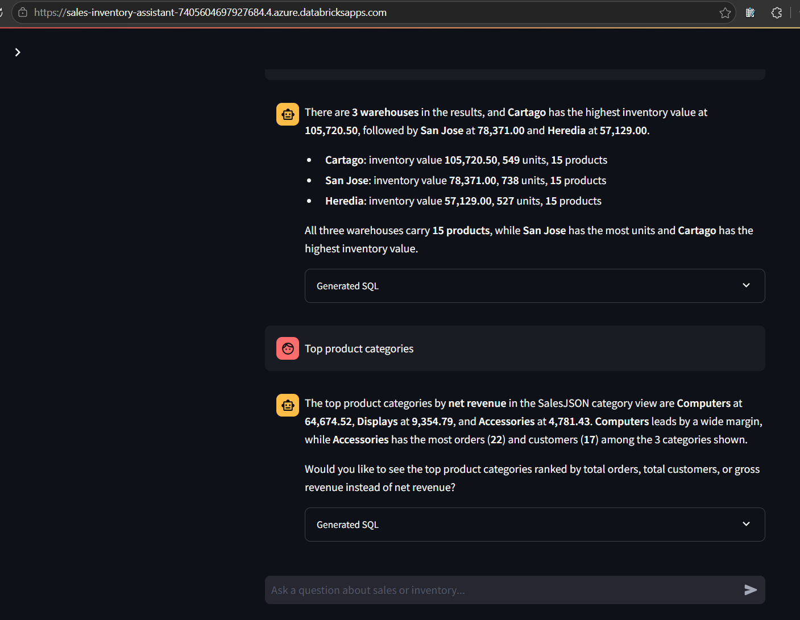
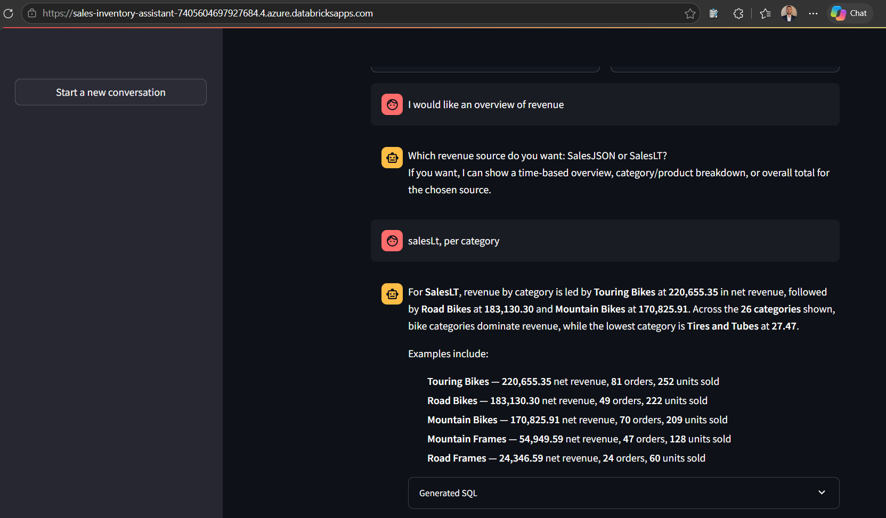

# Databricks App consumption evidence

**Phase status: COMPLETE.** This folder proves that the Streamlit Sales & Inventory Assistant is deployed and running in PROD from `main`. It uses the managed `genie-space` App Resource to invoke the existing governed Agent and preserves conversational business workflows without personal tokens.

| # | What the screenshot demonstrates |
|---|---|
| 01 | Running App home page with four governed quick prompts. |
| 02 | Multi-turn SalesJSON revenue conversation. |
| 03 | Low-stock and warehouse-inventory answers in one session. |
| 04 | Top SalesJSON product categories from Gold data. |
| 05 | Agent/SQL requests executed as the App service principal. |
| 06 | Free-form SalesLT category follow-up and continuity. |
| 07 | Running PROD deployment sourced from `main` with `genie-space`. |

## 01 — Running App home page

The live App exposes four governed quick prompts and a free-form conversational entry point.

## 02 — SalesJSON revenue conversation

The multi-turn exchange demonstrates governed SalesJSON revenue analysis and control over generated SQL display.

## 03 — Low-stock and inventory conversation

The App answers low-stock and warehouse-inventory questions in one session, proving conversational continuity on real business data.

## 04 — Top product categories

The App returns top SalesJSON categories from the governed Gold source rather than querying raw data directly.

## 05 — App service principal in Query History

Query History attributes Agent-generated SQL to the App service principal, demonstrating managed identity instead of a personal token.

## 06 — SalesLT category follow-up

The free-form follow-up demonstrates workload-aware SalesLT analysis and preserved conversational context.

## 07 — PROD deployment from main

The App overview shows `Running`, successful deployment history, `main` as the Git source, and the managed `genie-space` resource.

[Back to evidence index](../../README.md) · [Ver en español](README_ES.md)
