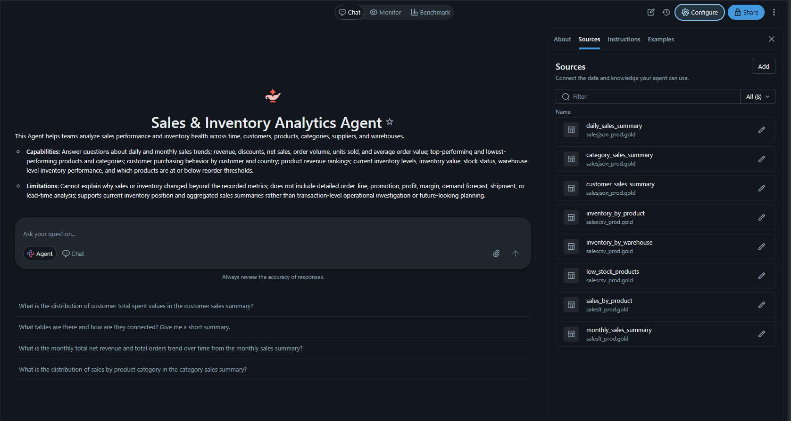
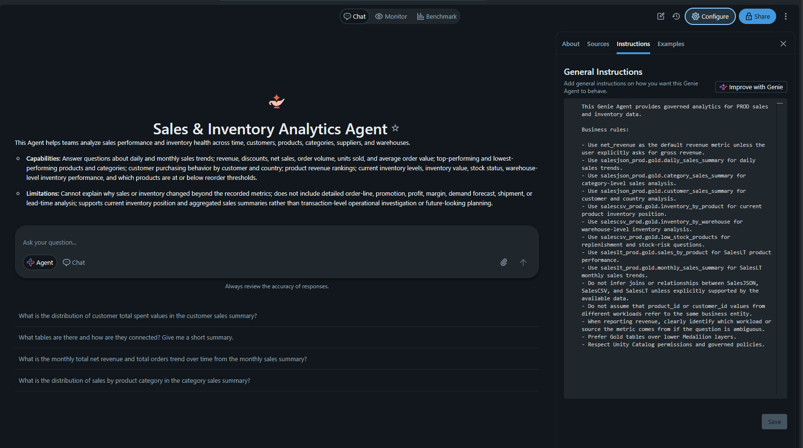
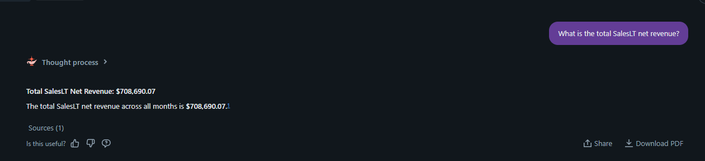
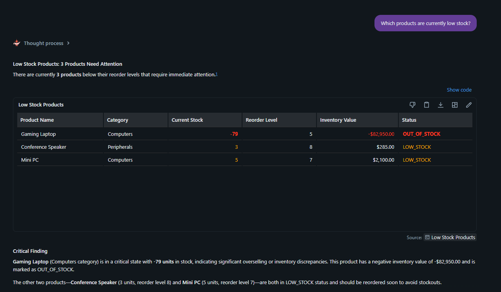
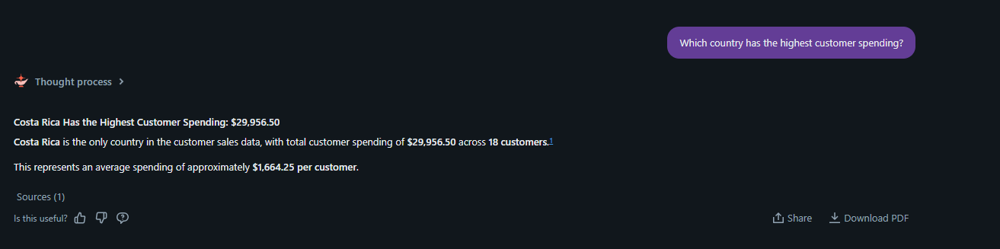
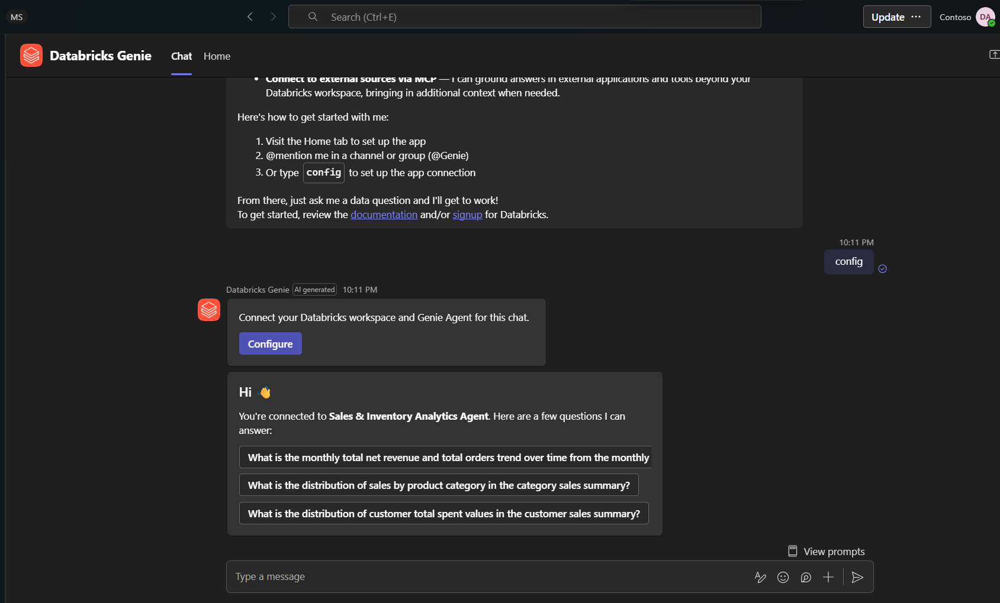
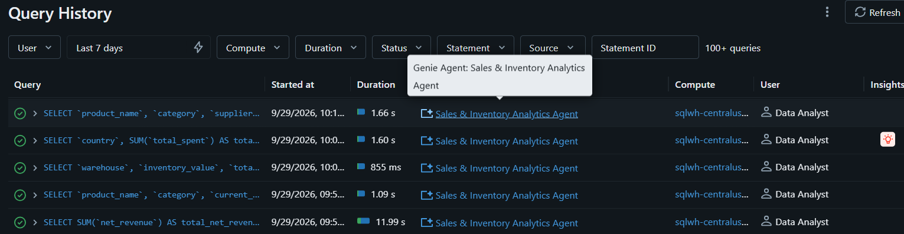

# Evidencia de Databricks Genie y Microsoft Teams

**Estado de fase: COMPLETO.** Esta carpeta documenta el Sales & Inventory Analytics Agent en PROD, sus fuentes e instrucciones gobernadas, respuestas de negocio validadas, consumo externo desde Microsoft Teams y atribución en Query History.

| # | Qué demuestra la captura |
|---|---|
| 01 | Identidad, propósito, capacidades y límites del Agent. |
| 02 | Ocho tablas Gold gobernadas como fuentes. |
| 03 | Instrucciones sobre métricas, aislamiento de workloads y gobierno. |
| 04 | Seis consultas de ejemplo, dos medidas y un filtro reutilizable. |
| 05 | Ingreso SalesLT validado de 708,690.07. |
| 06 | Valor de inventario por bodega validado en 241,220.50. |
| 07 | Tres productos validados con bajo stock. |
| 08 | Gasto de clientes SalesJSON por país. |
| 09 | Configuración del Agent en Microsoft Teams. |
| 10 | Respuesta gobernada de bajo stock en Teams. |
| 11 | SQL del Agent atribuido a Data Analyst en Query History. |

## 01 — Resumen del Genie Agent

El resumen registra el alcance de negocio y los límites analíticos explícitos del Agent.

## 02 — Fuentes gobernadas del Agent

El Agent utiliza ocho tablas Gold PROD de Unity Catalog entre SalesJSON, SalesCSV y SalesLT.

## 03 — Instrucciones del Agent

Las instrucciones exigen selección correcta de tablas, `net_revenue` por defecto, aislamiento de workloads, preferencia Gold y ausencia de joins inventados.

## 04 — Ejemplos, medidas y filtro semántico

La capa semántica curada contiene seis ejemplos, dos medidas y un filtro Low Stock reutilizable.

## 05 — Ingreso total SalesLT validado

El Agent devuelve el ingreso neto reconciliado de SalesLT: **708,690.07**.

## 06 — Valor de inventario por bodega

El desglose por bodega reconcilia en **241,220.50** entre Cartago, San José y Heredia.

## 07 — Productos con bajo stock

La respuesta gobernada identifica los tres productos validados por debajo del punto de reorden.

## 08 — Gasto de clientes por país

El resultado SalesJSON identifica Costa Rica como el país con mayor gasto usando métricas validadas.

## 09 — Configuración de Genie en Microsoft Teams

La app Databricks Genie de Teams está conectada al Sales & Inventory Analytics Agent correcto.

## 10 — Consulta gobernada de bajo stock en Teams

Data Analyst recibe los mismos tres productos con fuentes fuera del workspace de Databricks.

## 11 — Atribución de consultas a Data Analyst

Query History atribuye SQL exitoso generado por el Agent a Data Analyst y al SQL Warehouse PROD.

[Volver al índice de evidencias](../../README_ES.md) · [View in English](README.md)
