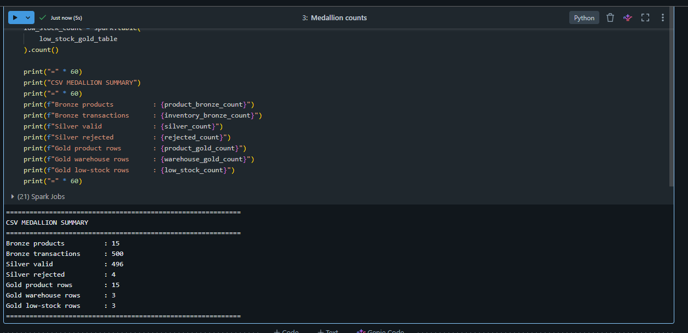
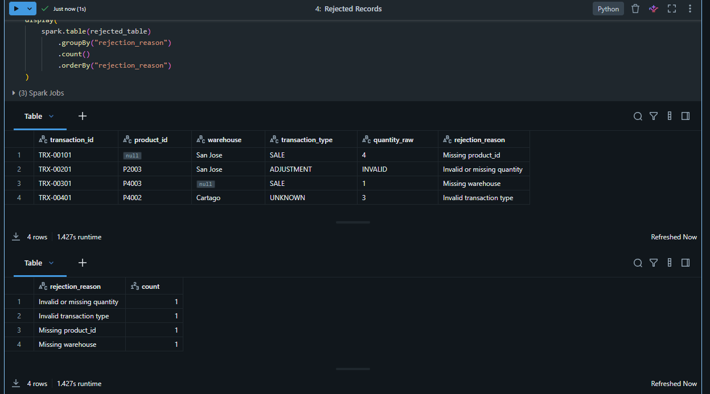
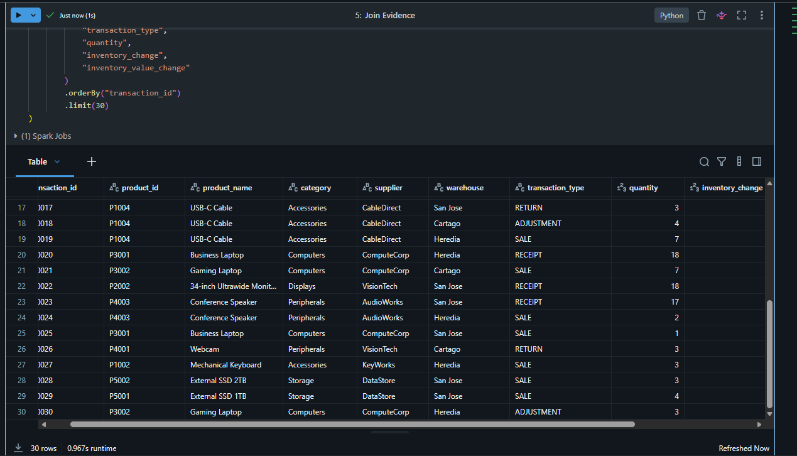
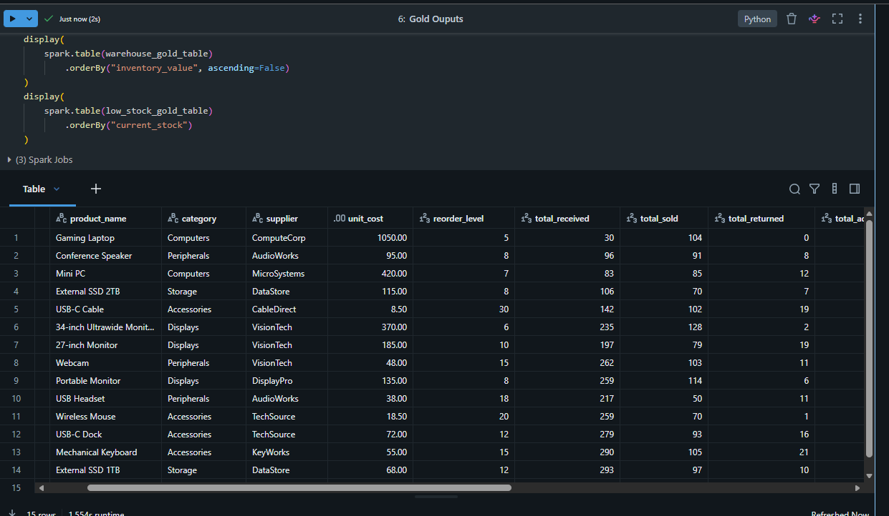
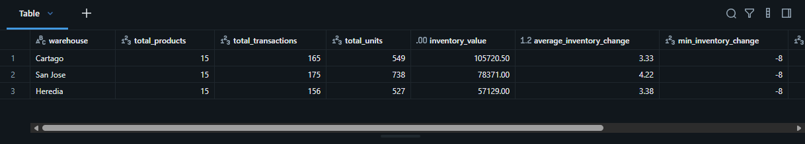
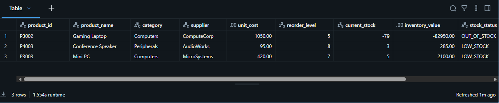
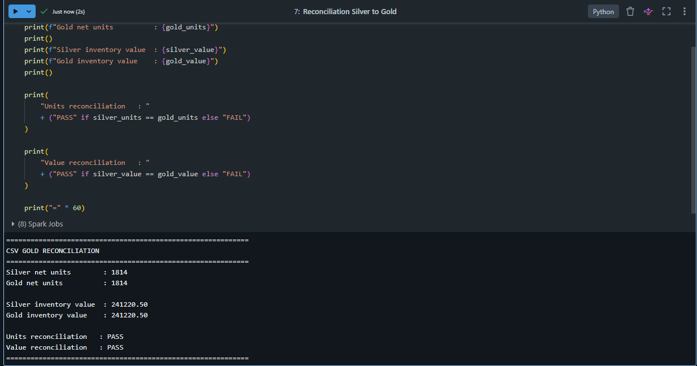
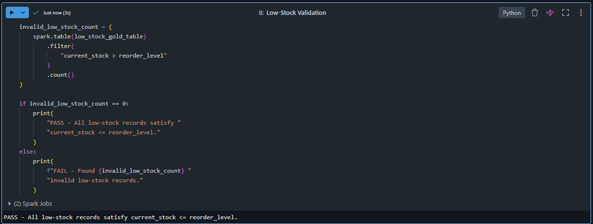
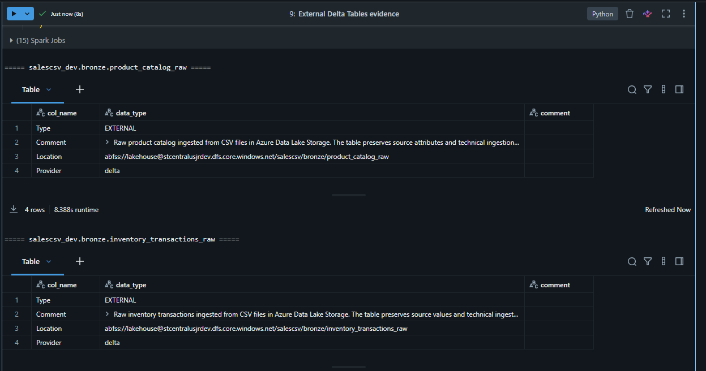

# Evidencia Medallion de SalesCSV

**Estado de fase: COMPLETO.** Esta carpeta demuestra la ruta batch de inventario desde Bronze CSV hasta Silver enriquecido y con calidad, y tres modelos Gold listos para negocio. Incluye rechazados, reconciliaciones, regla de bajo stock y propiedades de tablas Delta externas.

| # | Qué demuestra la captura |
|---|---|
| 01 | Conteos Medallion de productos y transacciones de inventario. |
| 02 | Cuatro transacciones Silver rechazadas y sus motivos. |
| 03 | Transacciones Silver enriquecidas mediante join con productos. |
| 04 | Inventario Gold por producto. |
| 05 | Inventario Gold por bodega. |
| 06 | Salida Gold de productos con bajo stock. |
| 07 | Reconciliación Silver-Gold de unidades y valor. |
| 08 | Validación de la regla de negocio de bajo stock. |
| 09 | Propiedades de almacenamiento de tablas Delta externas. |

## 01 — Conteos de capas Medallion

Los conteos muestran el catálogo y 500 movimientos convertidos en 496 transacciones válidas y 4 rechazadas.

## 02 — Registros rechazados en Silver

Los cuatro movimientos inválidos intencionales quedan en cuarentena con motivos explícitos en lugar de desaparecer.

## 03 — Transacciones de inventario Silver enriquecidas

La salida unida prueba que los movimientos fueron estandarizados y enriquecidos con atributos de producto.

## 04 — Inventario Gold por producto

El modelo Gold a grano de producto expone unidades actuales y valor de inventario para consumo analítico.

## 05 — Inventario Gold por bodega

El modelo por bodega presenta la distribución y los totales validados de valor de inventario.

## 06 — Productos Gold con bajo stock

El modelo identifica productos bajo su punto de reorden para procesos de reposición.

## 07 — Reconciliación Silver-Gold

Silver y Gold reconcilian en **1,814 unidades netas** y **241,220.50** de valor de inventario.

## 08 — Validación de regla de bajo stock

La validación confirma que cada fila Gold de bajo stock cumple la regla de reorden definida.

## 09 — Propiedades de tablas Delta externas

Las propiedades demuestran que los objetos Medallion utilizan las ubicaciones Delta externas previstas.

[Volver al índice de evidencias](../../README_ES.md) · [View in English](README.md)
