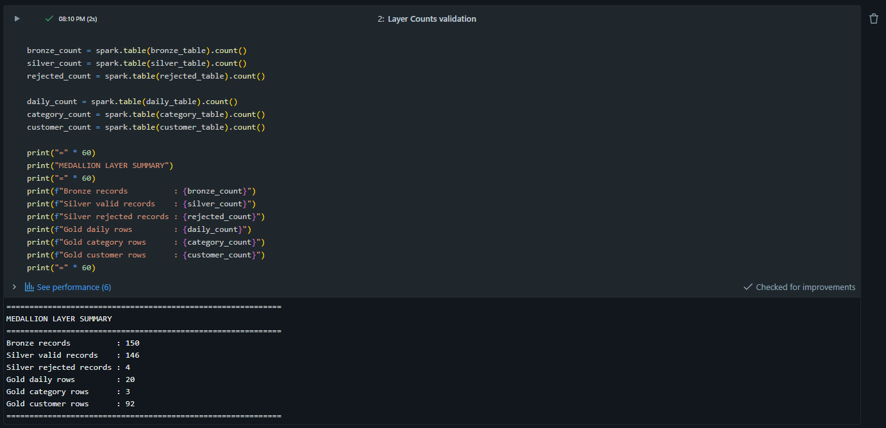
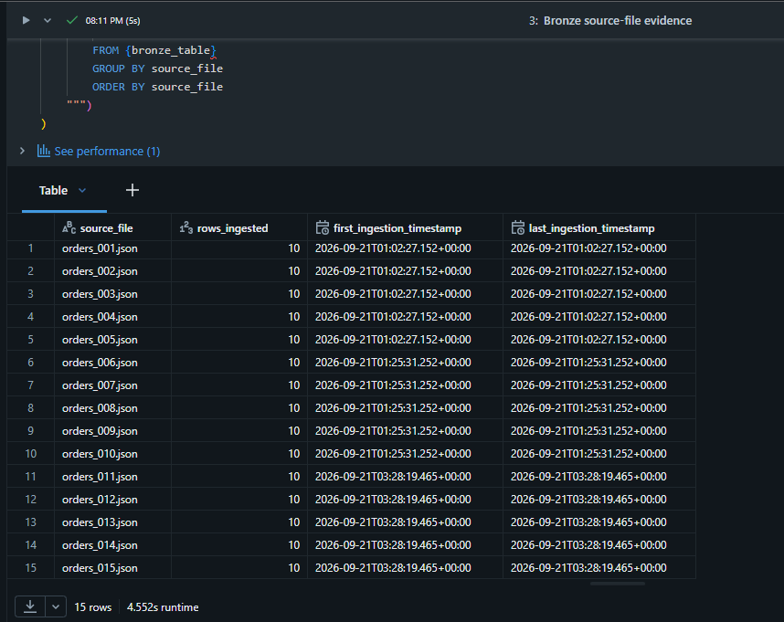
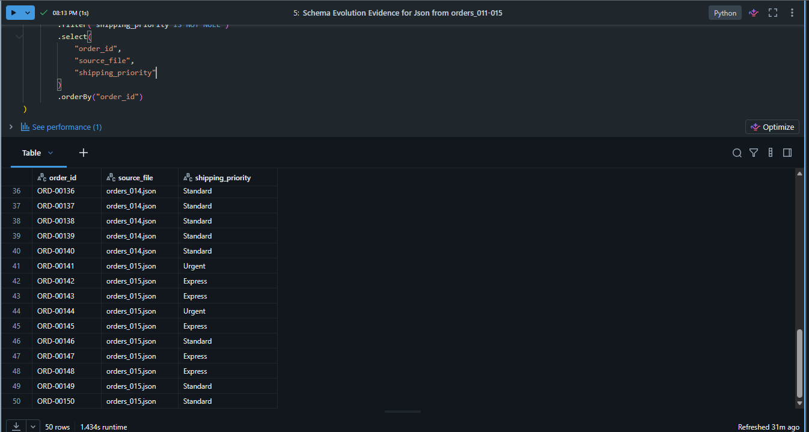
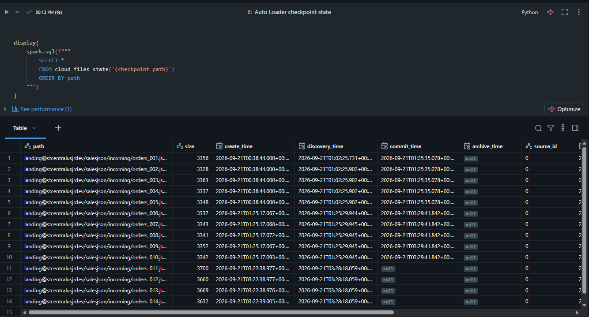
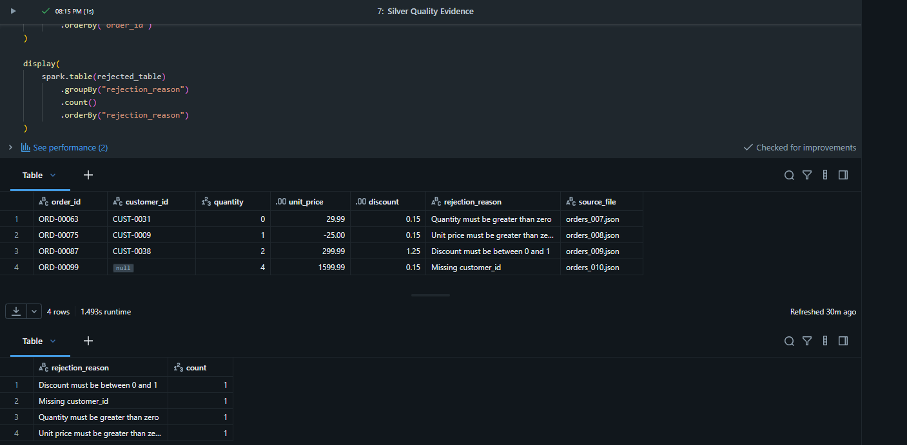
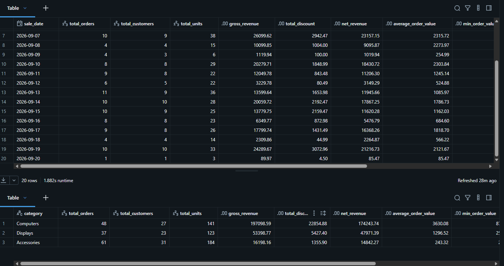
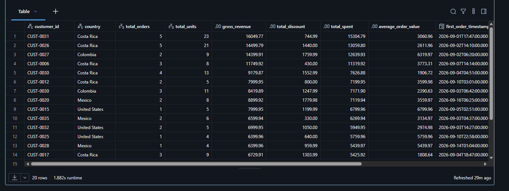
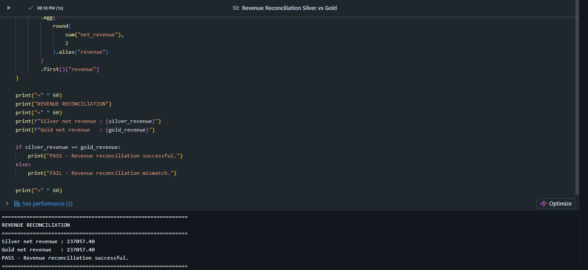

# SalesJSON Medallion evidence

**Phase status: COMPLETE.** This folder proves the incremental JSON path from ADLS through Auto Loader Bronze, quality-controlled Silver, and analytical Gold. It also validates additive schema evolution, persisted checkpoint state, rejected records, and exact revenue reconciliation.

| # | What the screenshot demonstrates |
|---|---|
| 01 | Row counts across Bronze, valid/rejected Silver, and the three Gold models. |
| 02 | Bronze traceability from each delivered JSON source file. |
| 03 | Successful additive schema-evolution validation. |
| 04 | The evolved `shipping_priority` field in orders 011–015. |
| 05 | Persisted Auto Loader checkpoint/schema state. |
| 06 | Four quarantined Silver records with explicit reasons. |
| 07 | Daily and category Gold analytical outputs. |
| 08 | Customer-level Gold metrics. |
| 09 | Exact Silver-to-Gold revenue reconciliation. |

## 01 — Medallion layer counts

Counts prove that 150 Bronze orders become 146 valid and 4 rejected Silver records, with the expected Gold outputs.

## 02 — Bronze source-file counts

Per-file counts preserve ingestion traceability across all delivered JSON files.

## 03 — Schema-evolution validation

Validation confirms that the additive schema change was accepted without breaking the pipeline.

## 04 — Evolved orders 011–015

Orders 011–015 expose the new `shipping_priority` field in the evolved Bronze/Silver schema.

## 05 — Auto Loader checkpoint state

Persisted checkpoint and schema state demonstrate resumable incremental ingestion rather than repeated full reloads.

## 06 — Silver rejected records

The four deliberate quality failures remain auditable in quarantine with explicit rejection reasons.

## 07 — Gold daily and category metrics

The daily and category Gold tables expose business-ready revenue aggregates derived only from valid Silver data.

## 08 — Gold customer metrics

Customer-level metrics demonstrate the third governed Gold consumption model.

## 09 — Silver-to-Gold revenue reconciliation

Silver and Gold reconcile exactly to **237,057.40**, proving that the aggregations preserve validated revenue.

[Back to evidence index](../../README.md) · [Ver en español](README_ES.md)
