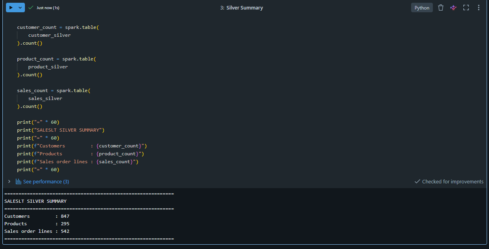
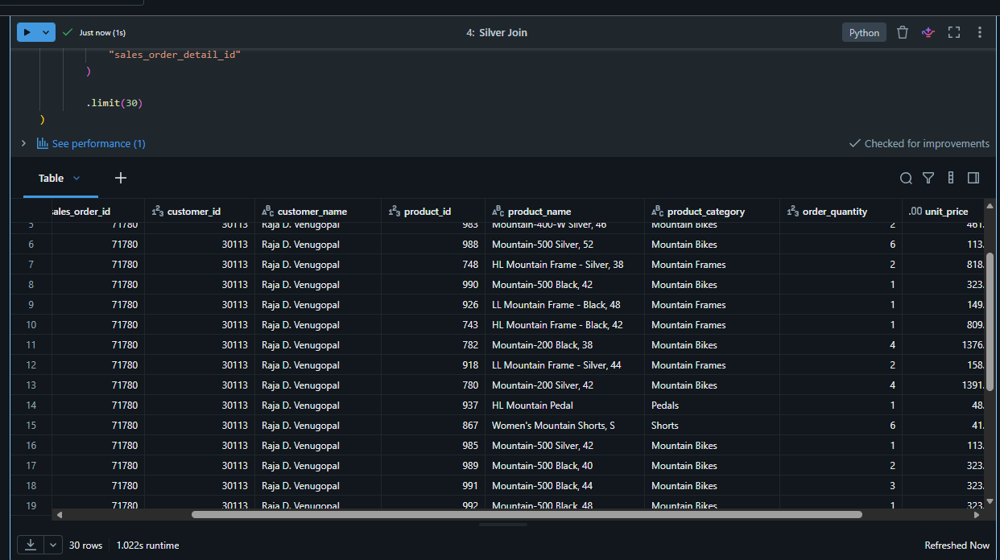
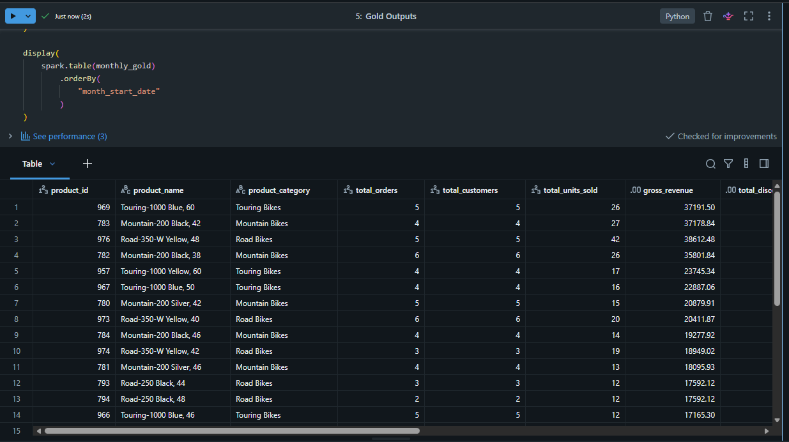
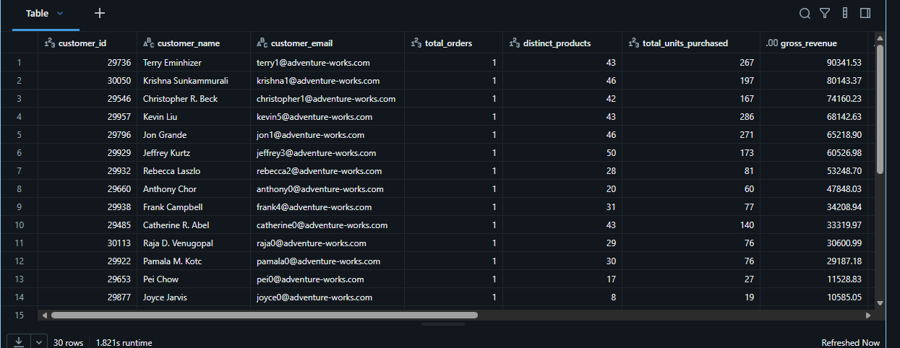
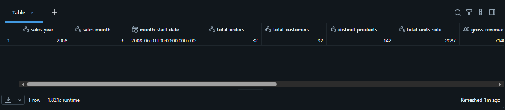
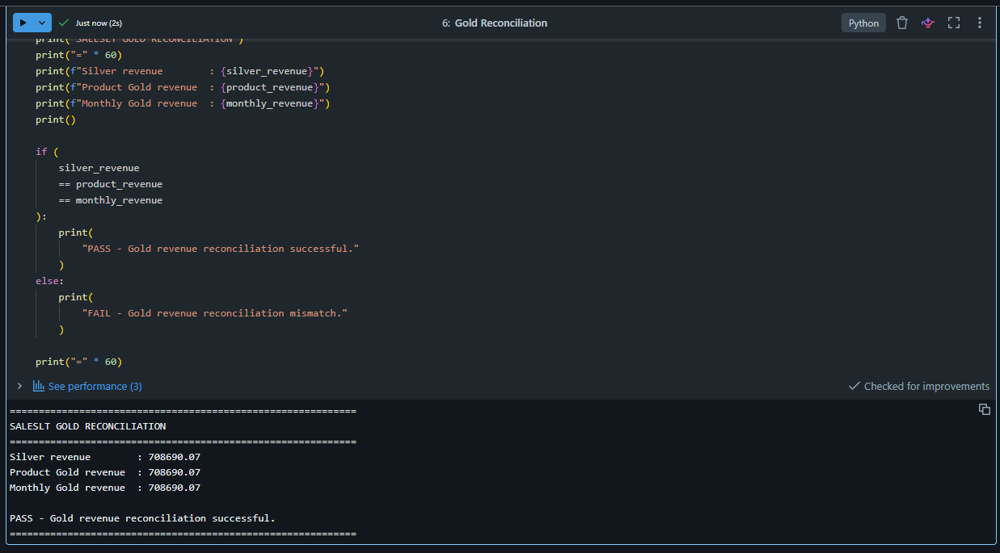

# Evidencia Medallion de SalesLT

**Estado de fase: COMPLETO.** Esta carpeta demuestra la ruta gobernada de SalesLT desde Lakehouse Federation privada con Azure SQL hacia Bronze Delta, seguida por joins Silver y modelos analíticos Gold. Los conteos y reconciliaciones validan completitud de extremo a extremo.

| # | Qué demuestra la captura |
|---|---|
| 01 | Conteos exactos fuente-Bronze para cinco tablas federadas. |
| 02 | Resumen de conteos y transformaciones de la capa Silver. |
| 03 | Salida enriquecida de líneas de venta en Silver. |
| 04 | Ventas Gold por producto. |
| 05 | Ventas Gold por cliente. |
| 06 | Resumen mensual de ventas Gold. |
| 07 | Reconciliación exacta de ingresos Silver-Gold. |

## 01 — Reconciliación SQL Federation-Bronze

Las cinco tablas federadas de Azure SQL coinciden con sus snapshots Bronze Delta, demostrando materialización completa mediante la ruta privada.

## 02 — Resumen de la capa Silver

El resumen valida clientes limpios, productos enriquecidos y líneas de venta unidas en Silver.

## 03 — Salida unida de ventas Silver

Las líneas de venta unidas demuestran el grano Silver listo para los agregados posteriores.

## 04 — Ventas Gold por producto

El resultado por producto expone ingresos y desempeño comercial al grano analítico previsto.

## 05 — Ventas Gold por cliente

El resultado por cliente admite análisis gobernado de ingresos por comprador.

## 06 — Resumen mensual de ventas Gold

El modelo mensual proporciona el agregado temporal validado para reportería.

## 07 — Reconciliación de ingresos Silver-Gold

Silver, Gold por producto y Gold por mes reconcilian exactamente en **708,690.07**.

[Volver al índice de evidencias](../../README_ES.md) · [View in English](README.md)
