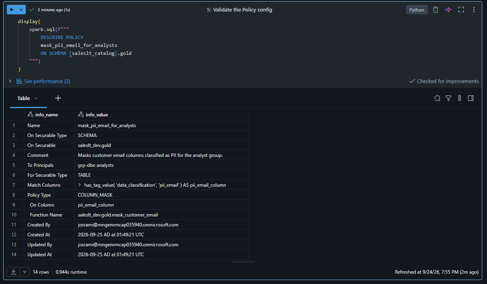
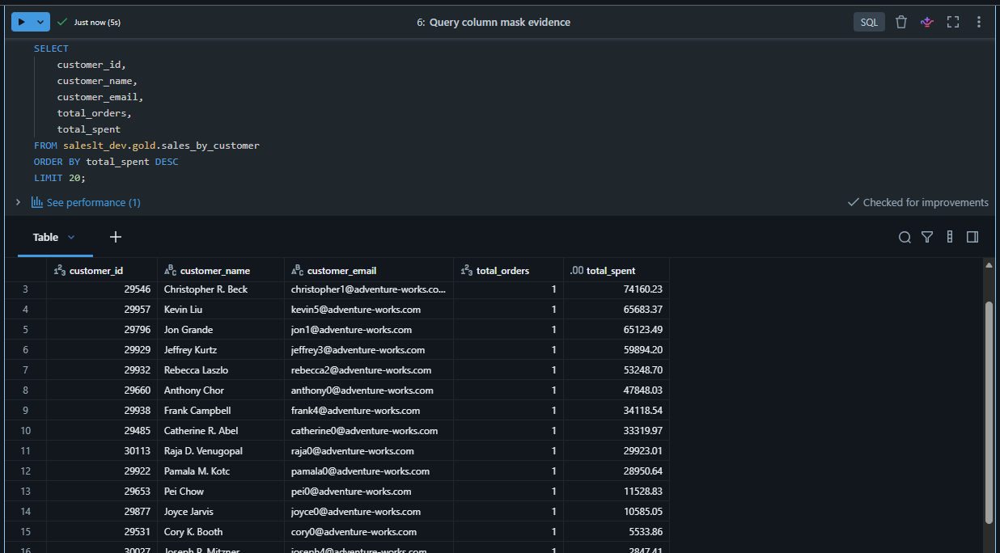
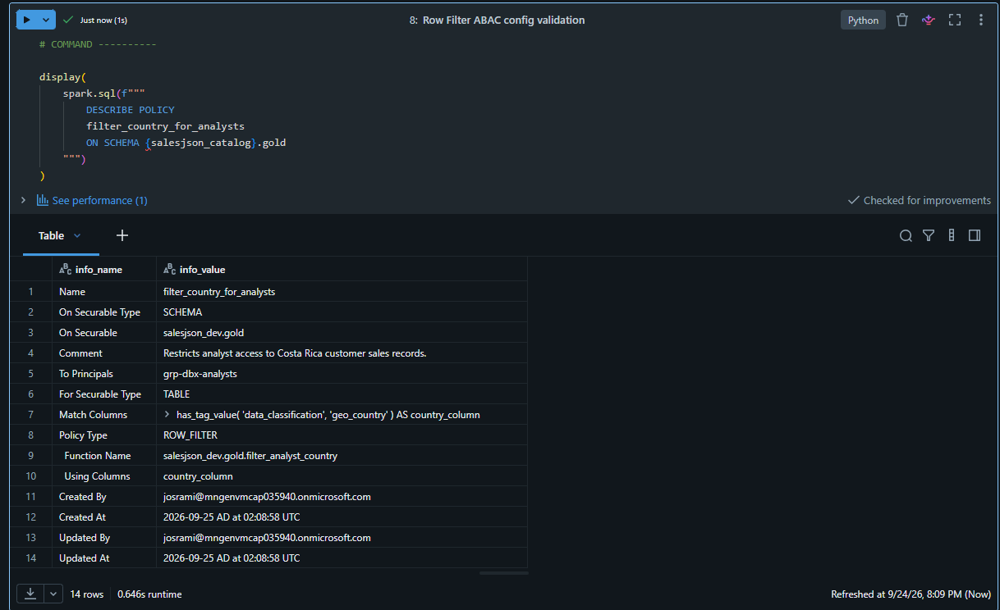
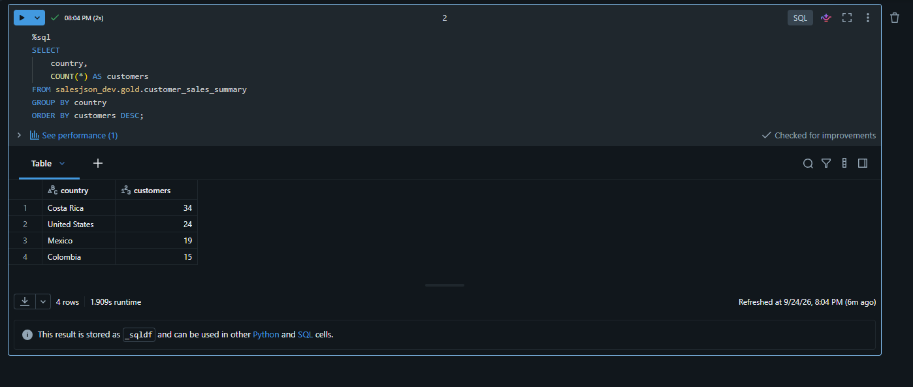

# Evidencia ABAC de Unity Catalog

**Estado de fase: COMPLETO.** Esta carpeta demuestra controles de datos gobernados y basados en tags en Unity Catalog. Cada configuración se acompaña con resultados para analyst e identidad privilegiada, mostrando aplicación real y no solo configuración.

| # | Qué demuestra la captura |
|---|---|
| 01 | Configuración de column mask para correo etiquetado. |
| 02 | Correos enmascarados para la identidad analyst. |
| 03 | Correos originales para la identidad developer privilegiada. |
| 04 | Configuración del row filter por país. |
| 05 | Analyst limitado a 34 filas de Costa Rica. |
| 06 | Developer privilegiado ve las 92 filas y todos los países. |

## 01 — Configuración de la política de column mask

El tag gobernado y la política asocian la función de enmascaramiento con el correo protegido del cliente.

## 02 — Analyst recibe correo enmascarado

La consulta del analyst devuelve valores ocultos, demostrando aplicación de la política para el consumidor.

## 03 — Developer recibe correo original

La comparación privilegiada devuelve valores originales y confirma la diferenciación por identidad.

## 04 — Configuración del row filter por país

El tag gobernado de país está asociado con la función de filtrado aplicada al resumen Gold de clientes.

## 05 — Filtro de país aplicado al analyst

El analyst ve únicamente **34 filas de Costa Rica**, demostrando control real a nivel de fila.

## 06 — Developer ve todos los países

La identidad privilegiada ve las **92 filas**, proporcionando el control comparativo del resultado filtrado.

[Volver al índice de evidencias](../../README_ES.md) · [View in English](README.md)
