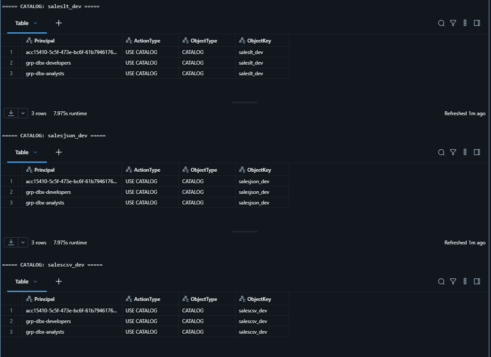
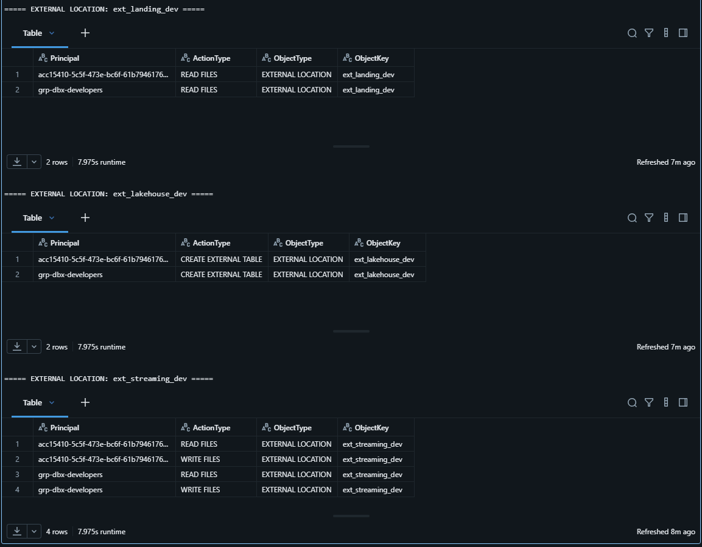
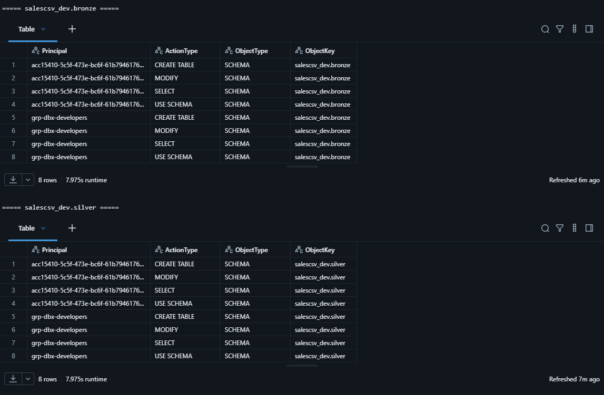
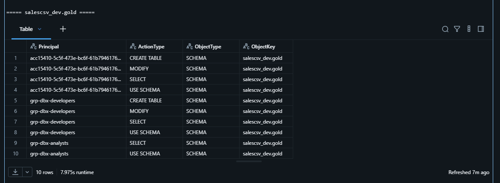
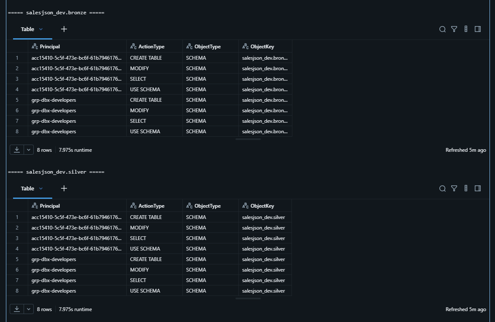
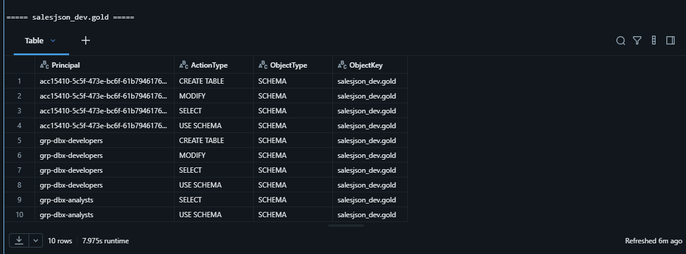
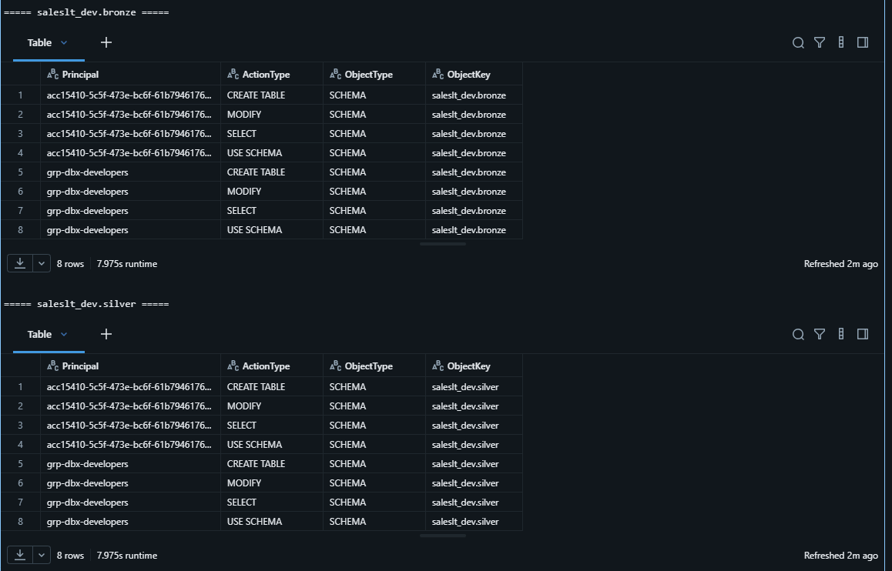
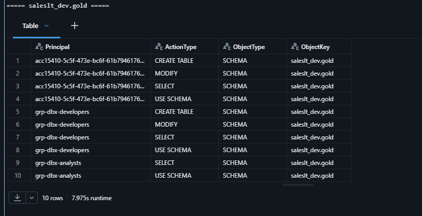

# Unity Catalog grants evidence

**Phase status: COMPLETE.** This folder documents least-privilege access across catalogs, external locations, and Medallion schemas. The screenshots show the effective grants that separate engineering, analytical consumption, ETL execution, and storage access.

| # | What the screenshot demonstrates |
|---|---|
| 01 | Catalog-level privileges and environment boundaries. |
| 02 | Scoped external-location access. |
| 03–04 | SalesCSV Bronze/Silver engineering grants and Gold consumer grants. |
| 05–06 | SalesJSON Bronze/Silver engineering grants and Gold consumer grants. |
| 07–08 | SalesLT Bronze/Silver engineering grants and Gold consumer grants. |

## 01 — Catalog grants

Catalog-level privileges demonstrate environment-aware access without granting unnecessary ownership.

## 02 — External-location grants

External locations are scoped so storage access remains mediated through Unity Catalog rather than direct credentials.

## 03 — SalesCSV Bronze and Silver schema grants

Engineering permissions cover transformation layers while remaining separate from Gold consumption access.

## 04 — SalesCSV Gold schema grants

Gold grants show the intended read-oriented consumer boundary for the inventory workload.

## 05 — SalesJSON Bronze and Silver schema grants

The JSON workload grants provide the required engineering access to its lower Medallion layers.

## 06 — SalesJSON Gold schema grants

The Gold schema permissions expose curated JSON analytics under least privilege.

## 07 — SalesLT Bronze and Silver schema grants

The federated workload grants authorize its ETL path without broad catalog or storage ownership.

## 08 — SalesLT Gold schema grants

The Gold permissions complete the governed consumer surface for SalesLT analytics.

[Back to evidence index](../../README.md) · [Ver en español](README_ES.md)
